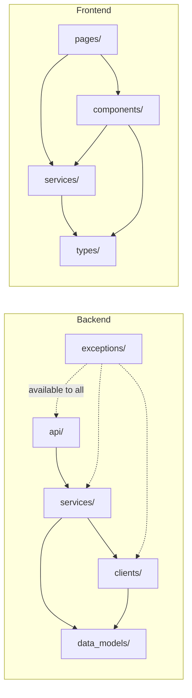
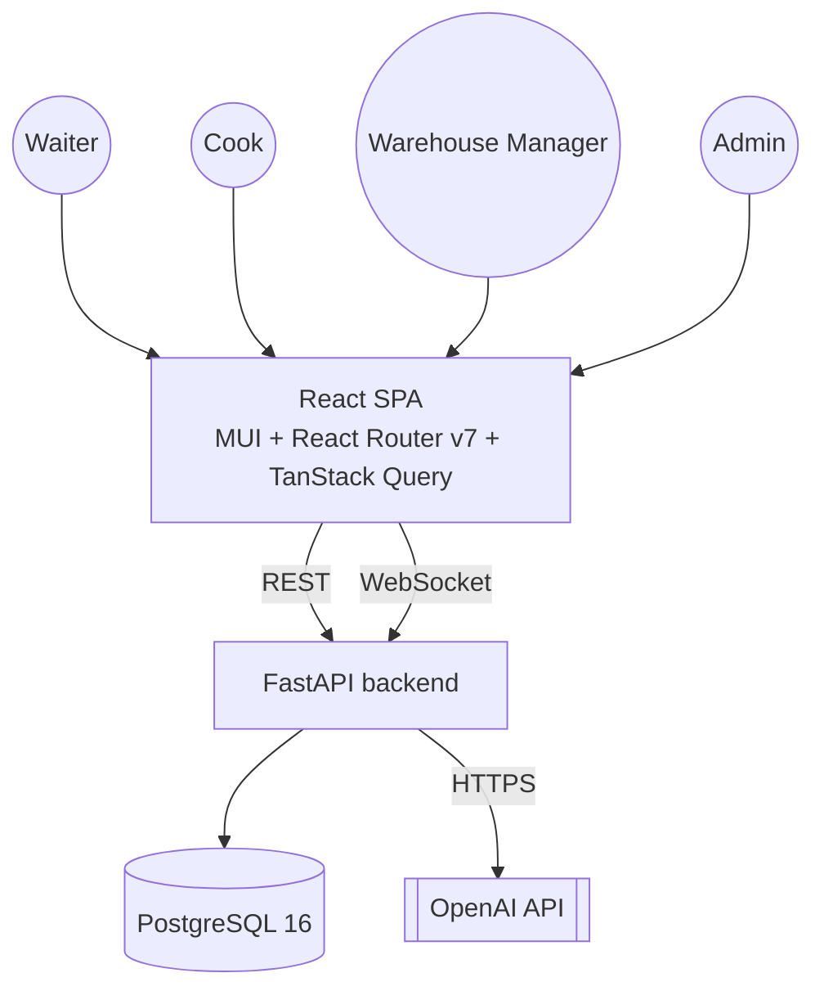
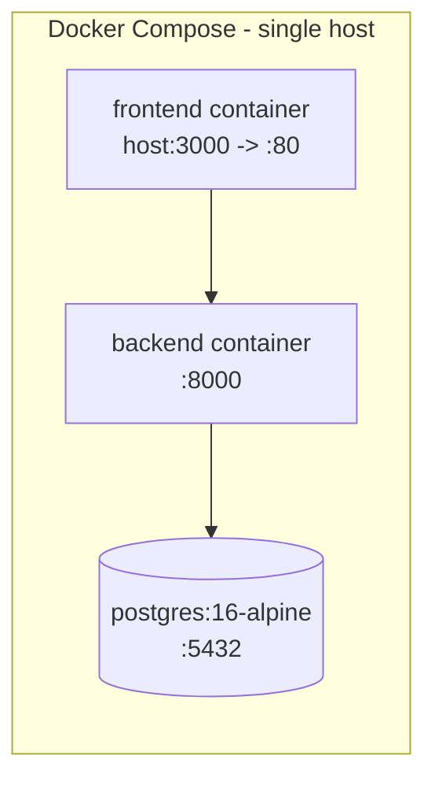
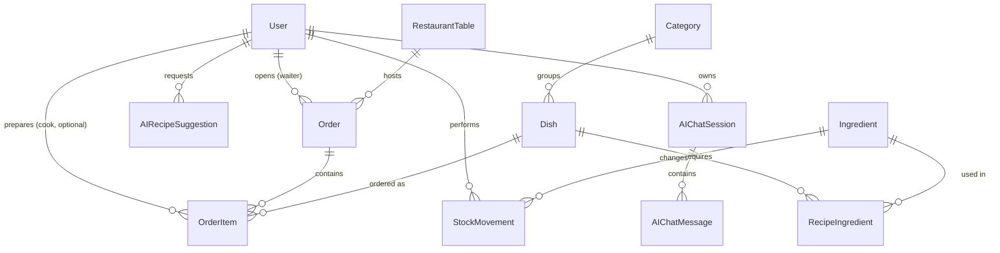

# Architecture Spine — Restaurant-Kitchen-Management-System

## Design Paradigm

Layered architecture on both tiers, connected by a typed REST + WebSocket boundary — ratifying the brownfield scaffold's existing (previously empty) folder intent rather than inventing a new shape.

- **Backend:** `api/` (FastAPI routers, one sub-router per domain) → `services/` (all business logic; the only layer that writes to the DB or calls an outbound client) → `clients/` (outbound adapters: DB, OpenAI) + `data_models/` (SQLAlchemy models & Pydantic schemas). `exceptions/` is a cross-cutting leaf usable from any layer. Composition root: `dependency_injector.containers.DeclarativeContainer` (`backend/container.py`) — every lifecycle-managed resource is a `providers.Resource`.
- **Frontend:** `pages/` (route-level, one area per role) → `components/` (reusable UI) + `services/` (API/WebSocket clients, exposed as TanStack Query hooks) → `types/`. TanStack Query is the server-state layer; local component state covers the rest.



**Rule (dependency direction):** `api/` may depend on `services/` only. `services/` may depend on `clients/` and `data_models/`. `clients/` may depend on `data_models/`. Nothing depends back upward. `exceptions/` is a leaf. Frontend mirrors this: `pages/` may depend on `components/` and `services/`; `components/` may depend on `services/` and `types/`; `services/` may depend on `types/`; nothing imports `pages/`.

## Invariants & Rules

### AD-1 — Layered backend with a single DI composition root [ADOPTED]

- **Binds:** all backend code
- **Prevents:** business logic leaking into route handlers; ad-hoc singletons/global state bypassing the container; a second composition mechanism appearing alongside `dependency-injector`
- **Rule:** routes in `api/` (one sub-router per domain, included into the main router) call only `services/`; `services/` holds all business logic and is the only layer permitted to open a DB transaction or call an outbound client; every lifecycle-managed resource (DB engine, OpenAI client, WebSocket connection registry) is wired as a `providers.Resource` on `backend/container.py`'s `Container`, never instantiated ad hoc.

### AD-2 — Real-time updates via WebSockets

- **Binds:** kitchen board and order/table status updates; Low-Stock Alerts to the Warehouse Manager (FR-14/UJ-3) — every push-style update named anywhere in the PRD, not just order/kitchen flow
- **Prevents:** different features independently choosing polling vs. push, or duplicating a second push mechanism; the same state change being announced under two different event names by two independently-built features
- **Rule:** all state-changing writes go through REST; the backend pushes change notifications over a single WebSocket endpoint per authenticated session, scoped to that user's role. A given state change is emitted exactly once, by the service layer that owns the mutation (per AD-1), under the single `{domain}.{event}` name fixed in Consistency Conventions — never re-announced under a second name by a different feature. Clients never treat the WebSocket as a write channel.

### AD-3 — Auth: JWT in an httpOnly cookie, explicit CORS

- **Binds:** all routes; the frontend API client
- **Prevents:** mixed auth schemes across domains; permissive/wildcard CORS; any route shipping unauthenticated once auth lands
- **Rule:** a JWT access token is issued at login and set as an httpOnly (Secure outside local dev, SameSite) cookie; every route except login/health requires a valid JWT verified via one shared FastAPI dependency; the FastAPI app registers `CORSMiddleware` with an explicit allow-list of the frontend origin(s), never a wildcard.

### AD-4 — DB schema managed via Alembic

- **Binds:** all `data_models/` changes
- **Prevents:** two people hand-editing the schema and desyncing; `Base.metadata.create_all` silently no-op'ing an `ALTER`; two parallel branches each generating a migration and producing divergent Alembic heads
- **Rule:** every `data_models/` change ships with an Alembic migration generated against the async template (`alembic init -t async`); `Base.metadata.create_all` is removed from the startup path once Alembic is wired. A branch that merges after another has already landed a migration must rebase and regenerate (or `alembic merge`) rather than leaving multiple heads.

### AD-5 — Concurrency: last-write-wins [ADOPTED — PRD NFR-6]

- **Binds:** Table, Order, OrderItem edits
- **Prevents:** one part of the system adding optimistic locking or a conflict UI while another assumes last-write-wins
- **Rule:** no version column, ETag, or conflict-resolution UI for Table/Order/OrderItem edits; the last write always wins.

### AD-6 — Guarded, atomic OrderItem status transitions [ADOPTED — PRD NFR-3]

- **Binds:** every OrderItem status transition (`pending`→`in_preparation`, →`ready`, and the cancel/void transition of AD-11); `Ingredient.current_stock`; `StockMovement`
- **Prevents:** two near-simultaneous transitions on the same OrderItem both applying (NFR-3); a stock deduction partially applied on failure, or skipped/duplicated under concurrency
- **Rule:** every OrderItem status transition is a conditional update guarded by the row's expected prior status (`UPDATE ... WHERE id = ? AND status = <expected>`, checked via rowcount, or an equivalent row lock) — a transition whose precondition no longer holds fails cleanly rather than silently double-applying. For the `in_preparation` transition specifically, the status update, the `Ingredient.current_stock` decrement, and the `StockMovement(consumption)` insert happen in one DB transaction. This atomicity/guardedness is stricter than AD-5's last-write-wins and is never weakened by it — AD-5 covers Table/Order/OrderItem *field* edits (notes, quantity), not status-transition races.

### AD-7 — Price lock at add-time [ADOPTED — PRD FR-5/FR-8]

- **Binds:** OrderItem; `Order.total_amount`
- **Prevents:** an Order's total silently changing because a Dish's price changed after items were added; a cancelled item silently still counted in the total
- **Rule:** OrderItem stores `price_at_add`, captured from `Dish.price` at insert time; Order totals are always computed by summing stored `price_at_add × quantity` over non-cancelled OrderItems only (AD-11), never by joining live `Dish.price`.

### AD-8 — Dish availability gated on a non-empty recipe [ADOPTED — PRD FR-22]

- **Binds:** `Dish.is_available`; `RecipeIngredient`
- **Prevents:** a live, orderable Dish whose stock deduction is silently a no-op because it has zero recipe lines — whether that state is reached by flipping availability on directly, or by emptying an already-available Dish's recipe
- **Rule:** the service layer rejects setting `Dish.is_available = true` while that Dish has zero `RecipeIngredient` rows, **and** rejects deleting a Dish's last `RecipeIngredient` row while that Dish is currently available — the caller must mark it unavailable first (in the same request or a prior one).

### AD-9 — Role-level-only permissions [ADOPTED — PRD FR-2/FR-6]

- **Binds:** all authorization checks
- **Prevents:** one feature introducing per-resource/per-user filtering (e.g. "my tables only") that the rest of the system doesn't share
- **Rule:** authorization is a function of `User.role` alone; no endpoint filters results by resource ownership (`waiter_id`, `cook_id`, etc.) as an access boundary — only AD-10's UI default is exempt, and that exemption is display-ordering, not a query-level filter.

### AD-10 — Smart Chef provenance + sharing [ADOPTED — PRD FR-19/FR-20]

- **Binds:** `AIRecipeSuggestion`; Dish/recipe; `AIChatSession`
- **Prevents:** an AI-originated Dish losing its audit trail; a per-Cook access wall creeping into chat/suggestions; the "current-Cook-first" default being built as a server-side filter indistinguishable from AD-9's forbidden per-resource filtering
- **Rule:** promoting an `AIRecipeSuggestion` to a live Dish stores a nullable provenance FK on the resulting Dish/recipe back to that suggestion. `AIChatSession`/`AIRecipeSuggestion` list endpoints always return every session/suggestion regardless of requester (AD-9); each row carries its owning `user_id`, and "current-Cook-first" is a client-side sort/grouping on that field — never a server-side "mine-first" query parameter that omits or paginates around other Cooks' rows.

### AD-11 — Cancel/void as a status transition, no auto-reversal [ADOPTED — PRD FR-7]

- **Binds:** `OrderItem.status`; `StockMovement`
- **Prevents:** a cancel implemented as a row delete (breaks audit trail / FK integrity); an invented "undo consumption" movement the PRD explicitly rejected
- **Rule:** cancelling/voiding an OrderItem sets a terminal status via AD-6's guarded transition — it never deletes the row. Cancelling a `pending` item has no stock impact (nothing was deducted yet). Cancelling an `in_preparation` item leaves its prior deduction as-is — **no automatic compensating `StockMovement`** is inserted; the ingredients are treated as already used. A Warehouse Manager may separately log a manual `waste` movement (FR-15) if physically applicable — that is a distinct, human-triggered action, never an automated side effect of cancellation.

### AD-12 — Smart Chef client behind an interface

- **Binds:** the OpenAI integration
- **Prevents:** the OpenAI SDK being called directly from `services/`, making the integration hard to test or swap
- **Rule:** all OpenAI calls go through a client in `backend/clients/` (matching the existing `clients/database.py` pattern), configured with a single env-configured model; `services/` depends on that client's interface, never the `openai` package directly.

### AD-13 — Frontend layering + state ownership

- **Binds:** all frontend code
- **Prevents:** server data duplicated into ad-hoc local/global state; a second routing or component library appearing alongside the chosen ones
- **Rule:** React Router v7 owns routing; MUI is the only UI component library; TanStack Query is the only cache for server-derived data, updated on WebSocket push via `setQueryData`/`invalidateQueries`. Dependency direction follows the Design Paradigm diagram above.

### AD-14 — Smart Chef request lifecycle integrity [ADOPTED — PRD FR-18/FR-21]

- **Binds:** `AIRecipeSuggestion`, `AIChatMessage` writes; the FR-18 generation request path
- **Prevents:** two concurrent recipe-suggestion generations in flight for the same Cook; an orphaned `AIRecipeSuggestion` row or a dangling `AIChatMessage` left behind by a failed/timed-out OpenAI call
- **Rule:** a generation request is rejected (not queued) if that Cook already has one in flight — tracked via a status flag checked-and-set in the same transaction that creates the in-flight record. The `AIRecipeSuggestion`/`AIChatMessage` row is written only after the OpenAI call succeeds; a failed or timed-out call persists nothing.

### AD-15 — Last-Admin lockout guard [ADOPTED — PRD FR-3]

- **Binds:** `User.role`, `User.is_active` mutations
- **Prevents:** deactivating or demoting the last remaining active Admin, locking every user out of user management
- **Rule:** the service layer rejects any User update (deactivation, role change) that would leave zero active Admins in the system.

### AD-16 — Stock is never floor-capped at zero [ADOPTED — PRD FR-15]

- **Binds:** `Ingredient.current_stock` — both the automatic consumption path (AD-6) and manual Stock Movements (`purchase`/`waste`/`adjustment`, FR-15)
- **Prevents:** the automatic and manual paths silently disagreeing — one clamping stock at zero, the other allowing negative — which would make the audit trail stop reflecting what actually happened
- **Rule:** no code path clamps `Ingredient.current_stock` at zero; a `waste`, negative `adjustment`, or automatic `consumption` movement is applied in full even if it drives current stock negative.

## Consistency Conventions

| Concern | Convention |
| --- | --- |
| Naming (entities, files, interfaces, events) | Python: snake_case files/modules, PascalCase classes. TypeScript: PascalCase components, camelCase everything else. REST routes: `/api/{domain}/{resource}`, plural nouns. WebSocket events: `{domain}.{event}`, past-tense (e.g. `order.item_status_changed`). |
| Data & formats (ids, dates, error shapes, envelopes) | IDs: DB auto-increment integers (matches the existing schema). Timestamps: timezone-aware UTC datetimes only (`datetime.now(timezone.utc)`, never naive `datetime.utcnow()`), serialized with an explicit UTC offset. Errors: every error response carries its message under a top-level `detail` key — a `string` for app-raised exceptions (via handlers registered on custom types in `backend/exceptions/`), or FastAPI's native structured validation-error list for framework-level 422s; the frontend error handler checks `detail`'s type rather than assuming it's always a string. |
| State & cross-cutting (mutation, errors, logging, config, auth) | Mutation: only `services/` writes to the DB; `api/` routes never issue queries/commits directly. Errors: custom exception types live in `backend/exceptions/`, mapped to HTTP responses by app-level exception handlers. Logging: `loguru` via the existing container `Resource` pattern. Config: backend via `config.yaml` → `container.config`; frontend exclusively via `src/config/config.ts`. Auth: JWT httpOnly cookie verified by one shared FastAPI dependency; role is checked in that same dependency layer, never re-derived per route. |

## Stack

| Name | Version |
| --- | --- |
| Python | ≥3.12 |
| FastAPI | ≥0.115.0 |
| dependency-injector | ≥4.41.0 |
| SQLAlchemy (asyncio) | ≥2.0.0 |
| asyncpg | ≥0.29.0 |
| Alembic | 1.18.5 (async template) |
| PostgreSQL | 16-alpine |
| loguru | ≥0.7.0 |
| openai (Python SDK) | 2.48.0 |
| React | 19.0.0 |
| TypeScript | ~5.7.2 (strict) |
| Vite | ^6.0.5 |
| React Router | 7.8.0 |
| MUI (Material UI) | v9 (current major), React 19-compatible |
| TanStack Query | v5 |
| pnpm | 9.15.0 |

## Structural Seed



**Deployment & environments:** single environment (local / demo, matching the course-defense delivery model) via the existing Docker Compose topology — no cloud hosting, autoscaling, or CI/CD is in scope.



**Core entities** (names + relationships only — full attributes in `docs/database-schema.md`; the two schema deltas this spine requires, `price_at_add` and the cancel/void status, are AD-7 and AD-11 above, not shown here since an attribute that's itself an invariant belongs in an AD, not a diagram):



**Minimal source tree:**

```text
backend/
  api/            # FastAPI routers — one sub-router per domain (orders, kitchen, inventory, smart_chef, admin, auth), included into router.py
  services/       # business logic per domain — the only layer that writes
  clients/        # outbound adapters: database.py, openai_client.py (new)
  data_models/    # SQLAlchemy models + Pydantic schemas
  exceptions/     # custom exception types + registered handlers
  alembic/        # migration environment + versions (new)
  container.py    # DI composition root
  main.py

frontend/src/
  pages/          # route-level, one subfolder per role + smart-chef chat
  components/     # shared/reusable UI
  services/       # API + WebSocket clients, exposed as TanStack Query hooks
  types/          # shared TypeScript types
  config/         # env access (config.ts) — the only place import.meta.env is read
```

## Deferred

- **Stray `backend/data_models/exceptions/` folder** — an empty leftover on disk that conflicts with AD-1/`project-context.md`'s documented top-level `backend/exceptions/` convention; remove or relocate it during implementation, don't treat it as a second convention.
- **Toolchain version bumps** — `pnpm@9.15.0` (pinned in `frontend/package.json`) passed end-of-life in April 2026; `TypeScript ~5.7.2` is now two majors behind (TS 7.0's Go-rewrite compiler exists). Neither breaks anything today and a mid-sprint major-version jump carries real risk; ratified as-is for this sprint, flagged here as a housekeeping item for whenever there's slack.
- **UX/screen design** — role-by-role screen layout, navigation, and the Smart Chef chat UI belong to `bmad-ux`, not this spine.
- **Fuller human-facing OOD document** — this pass produced the build spine only (Fast path); a right-sized design document to seed the graded OOD deliverable is a later pass, closer to submission, once the design has proven out through building.
- **Production-grade deployment** — cloud hosting, autoscaling, CI/CD, TLS termination: out of scope. This ships as a local Docker Compose demo for the course defense (see Structural Seed).
- **Rate limiting / API throttling** — not needed at this scale (small academic-team usage volume), consistent with the PRD's decision not to cap OpenAI spend.
- **WebSocket handshake mechanics** (exact auth-token transport: query param vs. subprotocol vs. cookie-on-upgrade) — left to implementation; AD-3 only fixes that it must be gated by the same JWT.
- **Exact `OrderItem`/`Order` status enum literals**, including the new cancelled/void state (FR-7) — left to the Alembic migration/code; AD-11 is the binding invariant, not the literal name.
- **Table delete/renumber** (PRD's other open question) — a product/FR-level decision, not architectural; punt to epics/stories.
- **JWT session duration** — `[ASSUMPTION]` 8-hour access token, silent re-login on expiry, resolving the PRD's open "session-survives-refresh duration" question; flagged for Ofek's review, not yet adopted.
