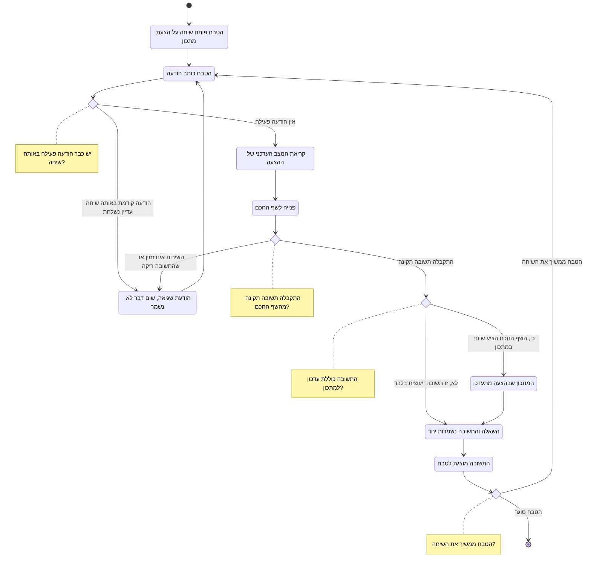

# דיאגרמת Activity: שיחת ייעוץ עם השף החכם

## הסבר התהליך

1. **שיחה עם השף החכם קיימת רק סביב הצעת מתכון.** זו נקודה שחשוב להיות מדויקים לגביה: אין
   במערכת מסך שפותח שיחה על מנה קיימת בתפריט. לכל שיחה יש הצעת מתכון אחת שהיא סובבת סביבה.
2. **ההקשר נקרא מחדש בכל הודעה.** לפני כל פנייה המערכת קוראת את **המצב העדכני** של ההצעה,
   ולא צילום מצב שנשמר בפתיחת השיחה. כך שינוי שנעשה למתכון בהודעה קודמת באותה שיחה משתקף
   מיד בהודעה הבאה.
3. **שתי הודעות במקביל באותה שיחה נדחות.** שתי הודעות בו-זמנית שוברות את רצף השיחה ואת
   ההקשר שהשף החכם מסתמך עליו. שיחות שונות של אותו טבח יכולות להתנהל במקביל.
4. **ההחלטה אם לעדכן את המתכון מתקבלת בכל הודעה מחדש, לא פעם אחת עבור השיחה כולה.**
   השף החכם מחליט, לפי תוכן ההודעה, אם היא מבקשת שינוי במתכון או רק שואלת/מייעצת. הטבח
   יכול, באותה שיחה עצמה, לשלוח הודעת ייעוץ ואז הודעה שמבקשת שינוי, וההודעה הבאה תמיד
   נבדקת מחדש.
5. **השאלה והתשובה נשמרות יחד או בכלל לא.** אם הפנייה נכשלת, גם השאלה של הטבח אינה
   נשמרת. כך אין בהיסטוריה שאלות תלויות בלי מענה.
6. **תשובה ריקה נחשבת כישלון.** תשובה ריקה או פגומה אינה נשמרת כאילו הייתה מוצלחת.
7. **כישלון אינו מאבד את השיחה.** הטבח נשאר בשיחה, רואה את השגיאה, ויכול לנסות שוב.
8. **השיחות נשמרות.** הטבח יכול לחזור לשיחה קודמת ולהמשיך אותה מהמקום שבו הפסיק.
