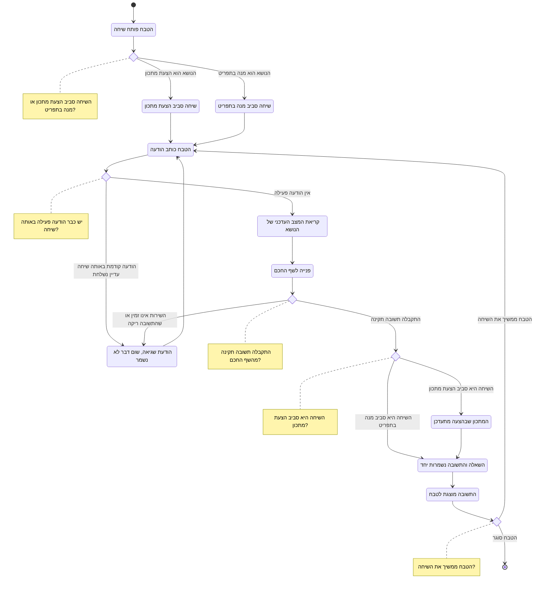

# דיאגרמת Activity: שיחת ייעוץ עם השף החכם

## הסבר התהליך

1. **לכל שיחה יש נושא אחד.** הטבח פותח שיחה סביב **הצעת מתכון** או סביב **מנה קיימת
   בתפריט**, אף פעם לא סביב שניהם ואף פעם לא בלי נושא.
2. **ההקשר נקרא מחדש בכל הודעה.** לפני כל פנייה המערכת קוראת את **המצב העדכני** של הנושא,
   ולא צילום מצב שנשמר בפתיחת השיחה. כך שינוי שנעשה למתכון בינתיים משתקף מיד בשיחה.
3. **שתי הודעות במקביל באותה שיחה נדחות.** שתי הודעות בו-זמנית שוברות את רצף השיחה ואת
   ההקשר שהשף החכם מסתמך עליו. שיחות שונות של אותו טבח יכולות להתנהל במקביל.
4. **הנה ההבדל המהותי בין שני סוגי השיחה:**
   - **שיחה סביב הצעת מתכון** יכולה **לשנות את המתכון שבהצעה**. ההצעה אינה מנה בתפריט,
     איש אינו מזמין אותה, ולכן עדכון שלה אינו משפיע על אף סועד.
   - **שיחה סביב מנה קיימת בתפריט היא לייעוץ בלבד.** מנה בתפריט היא מנה שסועדים מזמינים
     כרגע, ושינוי מתכונה בשיחה חופשית היה משנה את הניכוי מהמלאי בלי שהמנהל אישר זאת.
     הטבח מקבל עצה, ואם הוא רוצה לממש אותה הוא פונה למנהל.
5. **השאלה והתשובה נשמרות יחד או בכלל לא.** אם הפנייה נכשלת, גם השאלה של הטבח אינה
   נשמרת. כך אין בהיסטוריה שאלות תלויות בלי מענה.
6. **תשובה ריקה נחשבת כישלון.** תשובה ריקה או פגומה אינה נשמרת כאילו הייתה מוצלחת.
7. **כישלון אינו מאבד את השיחה.** הטבח נשאר בשיחה, רואה את השגיאה, ויכול לנסות שוב.
8. **השיחות נשמרות.** הטבח יכול לחזור לשיחה קודמת ולהמשיך אותה מהמקום שבו הפסיק.
