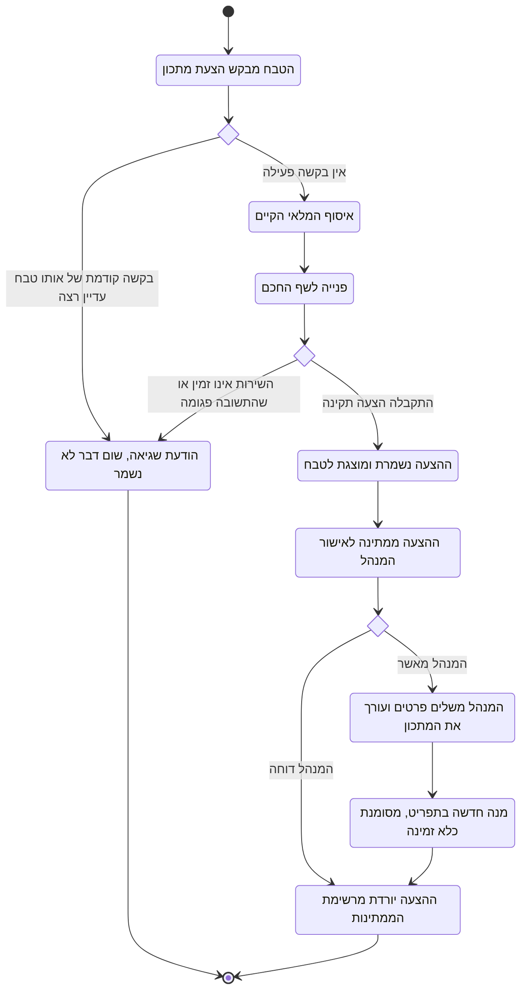

# דיאגרמת Activity: הצעת מתכון מהשף החכם ואישורה כמנה בתפריט

## הסבר התהליך

1. **ההצעה מבוססת על המלאי בפועל.** לפני הפנייה לשף החכם, המערכת אוספת את המרכיבים שיש
   מהם מלאי באותו רגע. הטבח יכול להוסיף כיוון חופשי, אך הכיוון **אינו גובר על מגבלת
   המלאי**, ויכול גם לבקש שההצעה תעדיף מרכיבים שכמותם גבוהה ביחס לרף שלהם.
2. **בקשה כפולה נדחית ואינה נכנסת לתור.** אם בקשה קודמת של אותו טבח עדיין רצה, הבקשה
   החדשה נדחית מיד. תור היה מייצר סדרת הצעות שהטבח כבר לא מעוניין בהן.
3. **כישלון אינו משאיר שובל.** אם השירות אינו זמין או שהתשובה שהתקבלה פגומה, **לא נשמרת
   שום רשומה**. אין הצעות ריקות בהיסטוריה.
4. **תקלה בשף החכם אינה משביתה את המערכת.** כל שאר המודולים ממשיכים לפעול כרגיל, והטבח
   מקבל הודעה ברורה ויכול לנסות שוב.
5. **ההצעה אינה נוגעת בתפריט.** זו הנקודה המרכזית בתהליך: מרגע שההצעה נשמרה היא ממתינה,
   ותו לא. הטבח שביקש אותה אינו יכול להפוך אותה למנה.
6. **רק המנהל מאשר.** באישור הוא משלים את הפרטים שההצעה אינה כוללת (קטגוריה, מחיר וזמן
   הכנה), והמערכת מציעה התאמה בין המרכיבים שההצעה מנתה למרכיבים הקיימים במלאי. **כל שורה
   ניתנת לעריכה** לפני האישור.
7. **המנה נוצרת כלא זמינה.** היא הופכת לניתנת להזמנה רק אחרי שיש לה מתכון תקין, ולכן
   מסלול האישור אינו יכול להכניס לתפריט מנה שהמטבח לא יידע מה לנכות עבורה.
8. **אותה הצעה אינה מאושרת פעמיים.** אם שני מנהלים מנסים לאשר את אותה הצעה במקביל, רק
   אחד מהם מצליח.
9. **המקור נשמר.** המנה החדשה זוכרת מאיזו הצעה נוצרה, כך שניתן לדעת בדיעבד אילו מנות
   בתפריט התחילו כהצעה של השף החכם.
