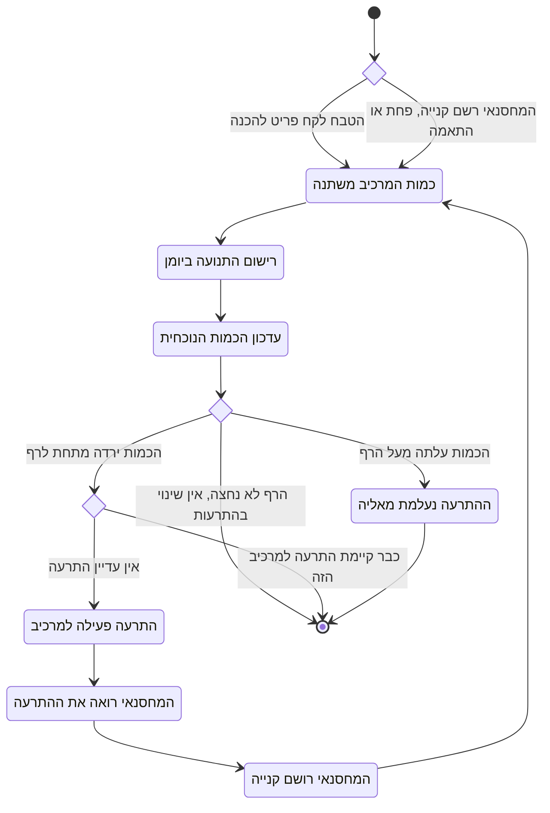

# דיאגרמת Activity: התרעת מלאי נמוך

## הסבר התהליך

1. **להתרעה יש שני מקורות, ואותו טיפול.** הכמות יורדת כשטבח לוקח פריט להכנה, וגם כשהמחסנאי
   רושם פחת או התאמת ספירה. המערכת אינה מבחינה ביניהם לצורך ההתרעה.
2. **קודם היומן, אחר כך הכמות.** אין שינוי בכמות בלי רישום מתאים ביומן התנועות. היומן אינו
   ניתן לעריכה בדיעבד, ולכן הוא התיעוד האמין של מה שקרה.
3. **ההתרעה מופקת רק ברגע חציית הרף, לא בכל תנועה.** זו הנקודה החשובה בתהליך. שתי לקיחות
   עוקבות של אותה מנה, ששתיהן משאירות את המרכיב מתחת לרף, מייצרות **התרעה אחת**, לא שתיים.
   בלי התנאי הזה המחסנאי היה מוצף בהתרעות חוזרות על אותו חוסר עצמו.
4. **התרעה אחת בלבד לכל מרכיב.** הצומת "כבר קיימת התרעה" היא ששומרת על כך.
5. **ההתרעה נסגרת מאליה.** אין פעולת "סימון כטופל". ברגע שקנייה מחזירה את הכמות מעל הרף,
   ההתרעה נעלמת בעצמה. מכאן שההתרעה אינה רשומה שנשמרת, אלא **תיאור של המצב הנוכחי**.
6. **המחסנאי רואה מיד, בלי לרענן.** ההתרעה מופיעה גם ברשימת ההתרעות וגם במונה שעל סרגל
   הניווט, משני המסכים, ברגע שהיא נוצרת.
7. **המעגל נסגר.** מההתרעה המחסנאי עובר ישירות לכרטיס המרכיב ורושם קנייה, וזו תנועה חדשה
   שמזינה את התהליך מהתחלה, הפעם בכיוון שמסיר את ההתרעה.
