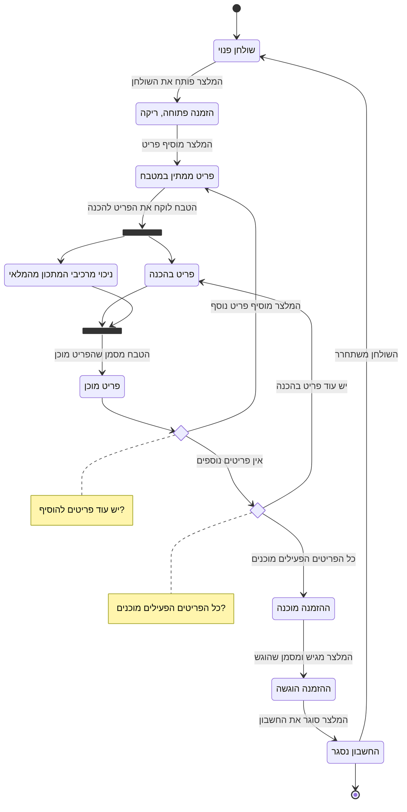

# דיאגרמת Activity: מסלול הזמנה מלא

## הסבר התהליך

1. **פתיחת השולחן.** המלצר בוחר שולחן פנוי ומסמן שסועדים התיישבו בו. הפעולה יוצרת הזמנה
   ריקה ומסמנת את השולחן כתפוס. שולחן שכבר תפוס אינו ניתן לפתיחה שנייה.
2. **הוספת פריטים.** המלצר בוחר מנה מהתפריט, קובע כמות ומוסיף הערה. **מחיר המנה נשמר
   בשורה באותו רגע**, כך ששינוי מחיר מאוחר יותר לא ישפיע על החשבון הזה.
3. **קליטה במטבח.** הפריט מופיע מיד בלוח המטבח, בלי שאיש יעביר אותו ידנית.
4. **לקיחה להכנה.** זו הנקודה היחידה בתהליך שבה המלאי משתנה. **שתי הפעולות מתרחשות
   יחד:** הפריט מסומן כנמצא בהכנה, ומרכיבי המתכון מנוכים מהמלאי לפי הכמות שהוזמנה. פס
   הסנכרון בדיאגרמה מציין בדיוק את זה - או ששתיהן מתבצעות, או שאף אחת מהן לא.
5. **סימון כמוכן.** הטבח מסיים ומסמן. מכאן האחריות חוזרת למלצר.
6. **הוספת פריטים באמצע.** הצומת "המלצר מוסיף פריט נוסף" מדגישה שההזמנה אינה נעולה:
   ניתן להוסיף מנה בכל שלב, והיא נכנסת ללוח המטבח כמו כל פריט אחר.
7. **מצב ההזמנה נגזר מהפריטים.** ההזמנה אינה מסומנת ידנית כ"מוכנה". היא הופכת למוכנה רק
   כאשר כל הפריטים הפעילים שבה מוכנים.
8. **הגשה.** המלצר מניח את המנות על השולחן ומסמן שההזמנה הוגשה.
9. **סגירת החשבון.** המערכת מסכמת את המחירים השמורים של הפריטים הפעילים, מציגה את הסכום
   לתשלום, ומחזירה את השולחן למצב פנוי כדי שיוכל לקבל סועדים חדשים.
