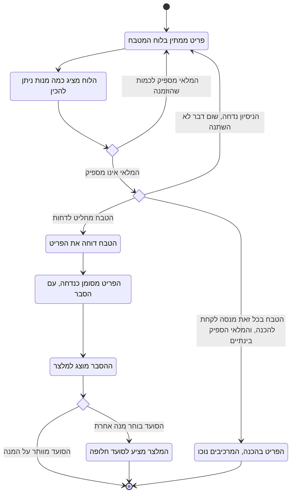

# דיאגרמת Activity: דחיית פריט במטבח מחוסר מלאי

## הסבר התהליך

1. **הלוח מחשב לבד.** לכל פריט ממתין, לוח המטבח מציג כמה מנות ניתן להכין ממנו **כרגע**
   לפי המלאי בפועל. החישוב מתרענן בכל טעינה של הלוח, כך שתנועת מלאי שנרשמה בינתיים
   משתקפת מיד.
2. **חוסר מלאי אינו עוצר את הטבח אוטומטית.** כשהכמות האפשרית קטנה מהמבוקשת, הלוח מציג
   התרעה ומחליף את הפעולה "קח להכנה" בפעולה "דחה".
3. **שני מסלולי כישלון נפרדים.** זו הנקודה החשובה בתהליך:
   - **ניסיון לקיחה שנכשל** - המערכת דוחה את הפעולה מעצמה. הפריט **נשאר ממתין**, המלאי
     אינו משתנה, ולא נוצר שום עדכון חלקי.
   - **דחייה יזומה** - הטבח מחליט במפורש שהפריט אינו בר-הכנה.
4. **דחייה אינה מנכה מלאי.** פריט שנדחה לא הוכן, ולכן לא נצרך דבר.
5. **הדחייה היא של הפריט כולו.** אין הכנה חלקית של חלק מהכמות המבוקשת.
6. **ההסבר חוזר למלצר.** הודעת הדחייה מציינת כמה מנות אפשר היה להכין בפועל, ומופיעה
   במסך ההזמנה של המלצר **בלי שירענן**. זה מה שמאפשר לו לגשת לסועד עם מידע מדויק.
7. **פריט שנדחה אינו נספר.** הוא אינו משפיע על מצב ההזמנה ואינו נכנס לסכום החשבון,
   בדיוק כמו פריט שבוטל.
8. **המקרה שבו המלאי הספיק בינתיים.** אם מרכיב התמלא בין רגע הצפייה לרגע הלקיחה, הלקיחה
   פשוט מצליחה. הפער הזה בין מה שהמסך הראה למה שקרה בפועל הוא מצב תקין ולא תקלה.
