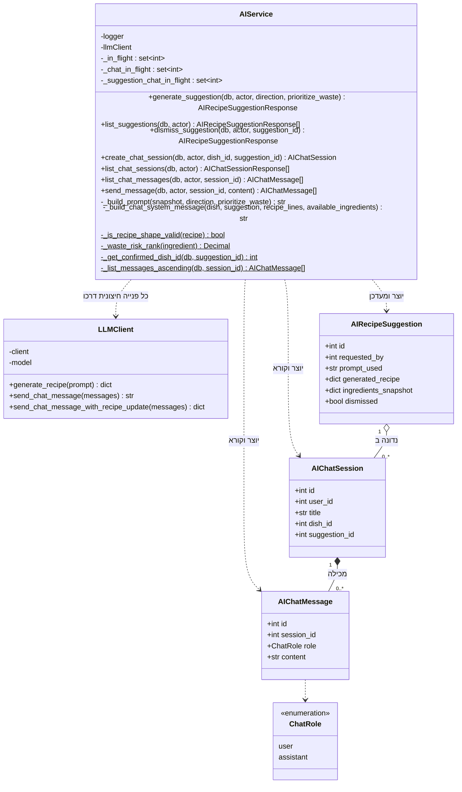

# דיאגרמת מחלקות: מודול השף החכם

## הסבר המחלקות

1. **`LLMClient` הוא המקום היחיד במערכת שמכיר את הספק החיצוני.** ספריית הספק מיובאת בקובץ
   הזה ובו בלבד. `AIService` מכיר שלוש מתודות ולא מכיר ספק. החלפת ספק היא שינוי בקובץ אחד.

2. **שלוש המתודות של המתאם נבדלות בצורת התשובה, ולא בכוונה:**
   - `generate_recipe` מבקשת מסמך מובנה.
   - `send_chat_message` מבקשת טקסט חופשי, לשיחה סביב מנה בתפריט.
   - `send_chat_message_with_recipe_update` מבקשת מסמך מובנה שמכיל גם תשובה וגם מתכון
     מעודכן, לשיחה סביב הצעה.

   הן מתודות נפרדות ולא הסתעפות בתוך מתודה אחת, כדי **שלכל אחת תהיה צורת תשובה אחת בלבד**.

3. **שלוש הרשימות הפרטיות הן שלוש מגבלות מקבילות שונות, ולא אחת משוכפלת:**

   | הרשימה | לפי מה | מה היא מונעת |
   |---|---|---|
   | `_in_flight` | טבח | בקשת הצעה שנייה של אותו טבח בזמן שהראשונה רצה |
   | `_chat_in_flight` | שיחה | שתי הודעות במקביל באותה שיחה, ששוברות את רצף השיחה |
   | `_suggestion_chat_in_flight` | הצעה | שתי שיחות שונות שמנסות לעדכן את אותה הצעה |

   הרשימה השלישית נדרשת מפני שהשנייה אינה מספיקה: שתי שיחות **שונות** יכולות להיות
   קשורות לאותה הצעה, ואז המגבלה לפי שיחה אינה חוסמת אותן.

   **הרשימות האלה הן הסיבה שהשירות הזה מוגדר כמופע יחיד** ולא נבנה מחדש בכל הזרקה. עותק
   חדש לכל בקשה היה מקבל רשימות ריקות, וכל שלוש המגבלות היו מפסיקות לעבוד **בשקט**.

4. **המתודות הסטטיות הן פונקציות טהורות.** בניית הפנייה, בדיקת צורת התשובה ודירוג הסיכון
   לבזבוז אינן תלויות במצב של השירות, ולכן ניתן לבדוק אותן בנפרד בלי שירות חיצוני ובלי
   מאגר.

5. **`_is_recipe_shape_valid` נקראת משני נתיבי כתיבה שונים**, יצירת הצעה ועדכון הצעה
   בשיחה. היא הוצאה למתודה משותפת בדיוק כדי ששני הנתיבים לא יתפצלו בהגדרה של "תשובה
   תקינה".

6. **אין שדה שמסמן שהצעה אושרה.** `_get_confirmed_dish_id` מחשבת זאת מהצד השני: היא בודקת
   אם קיימת מנה שמצביעה על ההצעה. אותה מתודה משמשת גם את הבדיקה שחוסמת אישור כפול וגם את
   הערך שמוחזר לתצוגה, כדי ששתיהן לא יוכלו להתפצל.

7. **הקשר בין שיחה להודעותיה הוא הרכבה**, והקשר בין הצעה לשיחות הוא צבירה: השיחה יכולה
   להתקיים סביב מנה במקום סביב הצעה.
