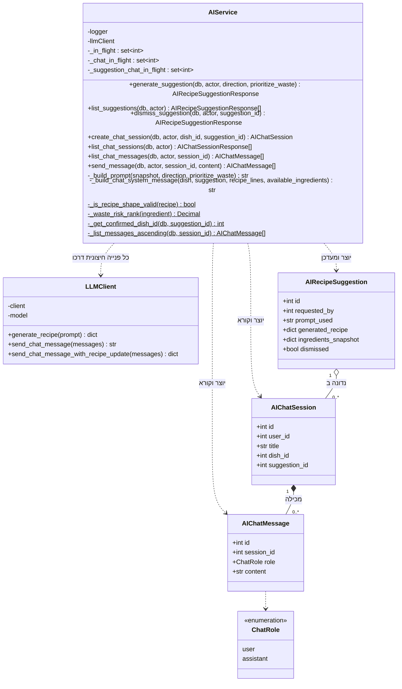

# דיאגרמת מחלקות: מודול השף החכם

```mermaid
classDiagram
    direction TB

    class AIService {
        -logger
        -llmClient
        -_in_flight : set~int~
        -_chat_in_flight : set~int~
        -_suggestion_chat_in_flight : set~int~
        +generate_suggestion(db, actor, direction, prioritize_waste) AIRecipeSuggestionResponse
        +list_suggestions(db, actor) AIRecipeSuggestionResponse[]
        +dismiss_suggestion(db, actor, suggestion_id) AIRecipeSuggestionResponse
        +create_chat_session(db, actor, dish_id, suggestion_id) AIChatSession
        +list_chat_sessions(db, actor) AIChatSessionResponse[]
        +list_chat_messages(db, actor, session_id) AIChatMessage[]
        +send_message(db, actor, session_id, content) AIChatMessage[]
        -_build_prompt(snapshot, direction, prioritize_waste) str
        -_build_chat_system_message(dish, suggestion, recipe_lines, available_ingredients) str
        -_is_recipe_shape_valid(recipe)$ bool
        -_waste_risk_rank(ingredient)$ Decimal
        -_get_confirmed_dish_id(db, suggestion_id)$ int
        -_list_messages_ascending(db, session_id)$ AIChatMessage[]
    }

    class LLMClient {
        -client
        -model
        +generate_recipe(prompt) dict
        +send_chat_message(messages) str
        +send_chat_message_with_recipe_update(messages) dict
    }

    class AIRecipeSuggestion {
        +int id
        +int requested_by
        +str prompt_used
        +dict generated_recipe
        +dict ingredients_snapshot
        +bool dismissed
    }

    class AIChatSession {
        +int id
        +int user_id
        +str title
        +int dish_id
        +int suggestion_id
    }

    class AIChatMessage {
        +int id
        +int session_id
        +ChatRole role
        +str content
    }

    class ChatRole {
        <<enumeration>>
        user
        assistant
    }

    AIService ..> LLMClient : כל פנייה חיצונית דרכו
    AIService ..> AIRecipeSuggestion : יוצר ומעדכן
    AIService ..> AIChatSession : יוצר וקורא
    AIService ..> AIChatMessage : יוצר וקורא
    AIRecipeSuggestion "1" o-- "0..*" AIChatSession : נדונה ב
    AIChatSession "1" *-- "0..*" AIChatMessage : מכילה
    AIChatMessage ..> ChatRole
```

*מודול השף החכם. `AIService` מחזיק שלוש מגבלות מקביליות בזיכרון ופונה לספק החיצוני דרך
`LLMClient`, שהוא המקום היחיד במערכת המכיר את הספק.*
