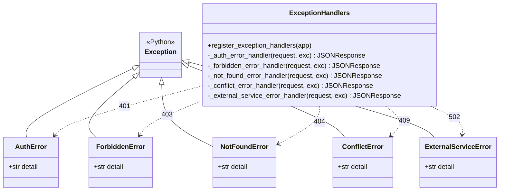

# דיאגרמת מחלקות: היררכיית השגיאות

*היררכיית השגיאות: חמש המשפחות יורשות ישירות מ-`Exception` של Python, ולכל אחת מהן מטפל
אחד המחזיר קוד תשובה קבוע. 39 הטיפוסים הקונקרטיים יורשים מן המשפחות ומפורטים בטבלה שבסוף
הסעיף.*
