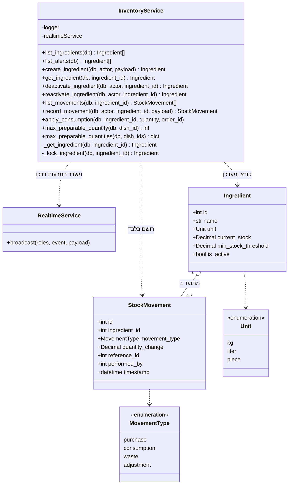

# דיאגרמת מחלקות: מודול המלאי

## הסבר המחלקות

1. **שתי מתודות הן נקודות הכניסה לשינוי מלאי, והן נפרדות בכוונה:**
   - `record_movement` היא הנתיב **הידני** של המחסנאי. היא שומרת ומשדרת בעצמה.
   - `apply_consumption` היא הנתיב **האוטומטי**, ונקראת אך ורק על ידי שירות ההזמנות בעת
     לקיחת פריט להכנה. **היא אינה שומרת ואינה משדרת בעצמה**, אלא משתתפת ביחידת העבודה של
     הקורא לה. זה מה שמאפשר לניכוי ולשינוי מצב הפריט להיות פעולה אחת בלתי ניתנת לפיצול.

   הפרדה זו גם אוכפת את הכלל שתנועת צריכה אינה ניתנת לרישום ידני: הנתיב הידני פשוט אינו
   מקבל את הסוג הזה.

2. **`_lock_ingredient` מול `_get_ingredient` היא הבחנה מהותית.** הראשונה נועלת את שורת
   המרכיב, והשנייה רק קוראת. שתי תנועות מקבילות על אותו מרכיב **חייבות** להסתדר בתור,
   אחרת השנייה תדרוס בשקט את הדלתא של הראשונה. פעולות קריאה בלבד אינן נועלות ואינן
   משלמות את המחיר.

3. **`list_alerts` היא שאילתה, לא ישות.** אין מחלקת "התרעת מלאי נמוך": ההתרעה היא תוצאה
   של השוואה בין הכמות הנוכחית לרף, ומחושבת בזמן הקריאה.

4. **`max_preparable_quantity` היא חישוב מייעץ בלבד.** היא אינה נועלת דבר, ולוח המטבח
   משתמש בה כדי להציג כמה מנות אפשר להכין. **הסמכות הקובעת היא הבדיקה שבתוך
   `apply_consumption`**, ברגע הכתיבה עצמה. פער בין מה שהוצג למה שקרה הוא מצב תקין.
   הגרסה ברבים קיימת כדי שלוח המטבח יחשב את כל המנות בפנייה אחת ולא באחת לכל שורה.

5. **הקשר בין מרכיב לתנועות הוא צבירה** (מעוין חלול) ולא הרכבה: התנועות שייכות למרכיב,
   אך הן רשומות יומן עצמאיות שאינן נמחקות ואינן משתנות לעולם.
