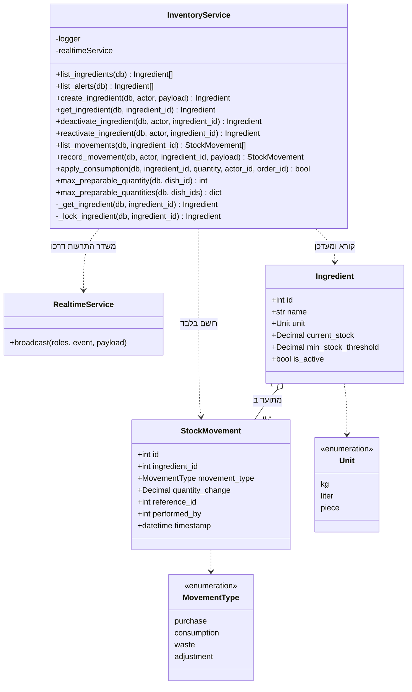

# דיאגרמת מחלקות: מודול המלאי

```mermaid
classDiagram
    direction TB

    class InventoryService {
        -logger
        -realtimeService
        +list_ingredients(db) Ingredient[]
        +list_alerts(db) Ingredient[]
        +create_ingredient(db, actor, payload) Ingredient
        +get_ingredient(db, ingredient_id) Ingredient
        +deactivate_ingredient(db, actor, ingredient_id) Ingredient
        +reactivate_ingredient(db, actor, ingredient_id) Ingredient
        +list_movements(db, ingredient_id) StockMovement[]
        +record_movement(db, actor, ingredient_id, payload) StockMovement
        +apply_consumption(db, ingredient_id, quantity, actor_id, order_id) bool
        +max_preparable_quantity(db, dish_id) int
        +max_preparable_quantities(db, dish_ids) dict
        -_get_ingredient(db, ingredient_id) Ingredient
        -_lock_ingredient(db, ingredient_id) Ingredient
    }

    class RealtimeService {
        +broadcast(roles, event, payload)
    }

    class Ingredient {
        +int id
        +str name
        +Unit unit
        +Decimal current_stock
        +Decimal min_stock_threshold
        +bool is_active
    }

    class StockMovement {
        +int id
        +int ingredient_id
        +MovementType movement_type
        +Decimal quantity_change
        +int reference_id
        +int performed_by
        +datetime timestamp
    }

    class Unit {
        <<enumeration>>
        kg
        liter
        piece
    }

    class MovementType {
        <<enumeration>>
        purchase
        consumption
        waste
        adjustment
    }

    InventoryService ..> RealtimeService : משדר התרעות דרכו
    InventoryService ..> Ingredient : קורא ומעדכן
    InventoryService ..> StockMovement : רושם בלבד
    Ingredient "1" o-- "0..*" StockMovement : מתועד ב
    Ingredient ..> Unit
    StockMovement ..> MovementType
```

*מודול המלאי. שתי נקודות כניסה נפרדות לשינוי הכמות, הנתיב הידני והנתיב האוטומטי,
לצד חישוב מייעץ של הכמות הניתנת להכנה ומתודת נעילה נפרדת ממתודת הקריאה.*
