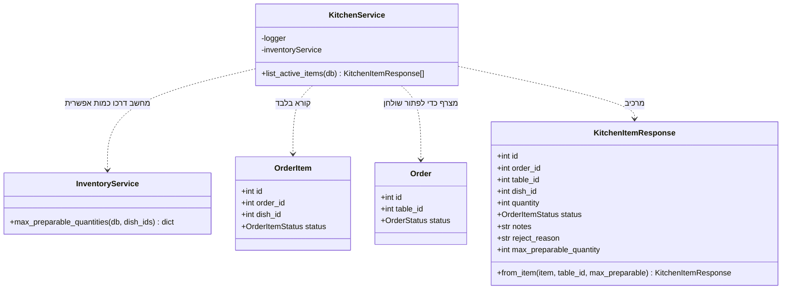

# דיאגרמת מחלקות: מודול המטבח

## הסבר המחלקות

1. **`KitchenService` הוא שירות קריאה בלבד.** אין בו אף מתודה שמשנה משהו. פעולות המטבח,
   לקיחה להכנה, סימון כמוכן ודחייה, יושבות ב-`OrderService`, מפני שהשינוי שהן מבצעות
   שייך לתחום ההזמנות ולא לתחום המטבח.

   זו החלטה שכדאי לשים לב אליה: **המסך הוא של המטבח, אבל הישות שמשתנה היא של ההזמנות**,
   והמודולים מחולקים לפי הישות ולא לפי המסך.

2. **`list_active_items` היא המקום היחיד במערכת שמצרף שתי ישויות.** פריט הזמנה מכיר את
   ההזמנה שלו אך לא את השולחן, ולוח המטבח מקבץ לפי שולחן. הצירוף פותר את השולחן בשרת,
   במקום לשלוח מזהים ולתת ללקוח לפתור אותם.

3. **`max_preparable_quantity` מחושב לכל שורה בפנייה אחת**, ולא בפנייה לכל שורה. הפנייה
   מרוכזת לפי מנה, מפני שכמה שורות יכולות להזמין את אותה מנה.

4. **הערך מחושב רק לפריט ממתין.** לפריט שכבר נלקח להכנה או שנדחה אין פעולה שנותרה לבצע,
   ולכן חיווי חוסר עליו היה מטעה.

5. **הסינון של הלוח כפול:** גם לפי מצב הפריט (לא בוטל ולא נדחה) וגם לפי מצב ההזמנה (לא
   הוגשה ולא נסגרה). בלי החלק השני, הזמנה שהוגשה הייתה ממשיכה להופיע בלוח.
