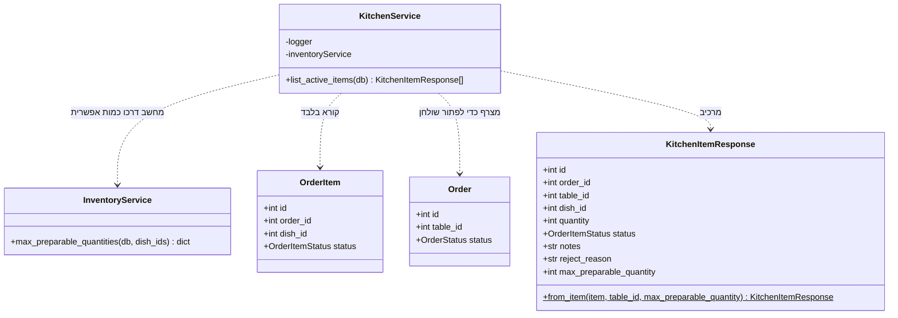

# דיאגרמת מחלקות: מודול המטבח

```mermaid
classDiagram
    direction TB

    class KitchenService {
        -logger
        -inventoryService
        +list_active_items(db) KitchenItemResponse[]
    }

    class InventoryService {
        +max_preparable_quantities(db, dish_ids) dict
    }

    class KitchenItemResponse {
        +int id
        +int order_id
        +int table_id
        +int dish_id
        +int quantity
        +OrderItemStatus status
        +str notes
        +str reject_reason
        +int max_preparable_quantity
        +from_item(item, table_id, max_preparable_quantity)$ KitchenItemResponse
    }

    class OrderItem {
        +int id
        +int order_id
        +int dish_id
        +OrderItemStatus status
    }

    class Order {
        +int id
        +int table_id
        +OrderStatus status
    }

    KitchenService ..> InventoryService : מחשב דרכו כמות אפשרית
    KitchenService ..> OrderItem : קורא בלבד
    KitchenService ..> Order : מצרף כדי לפתור שולחן
    KitchenService ..> KitchenItemResponse : מרכיב
```

*מודול המטבח. `KitchenService` הוא שירות קריאה בלבד, המצרף פריטי הזמנה יחד עם השולחנות
שלהם ומחשב לכל פריט ממתין כמה מנות ניתן להכין ממנו כרגע.*
