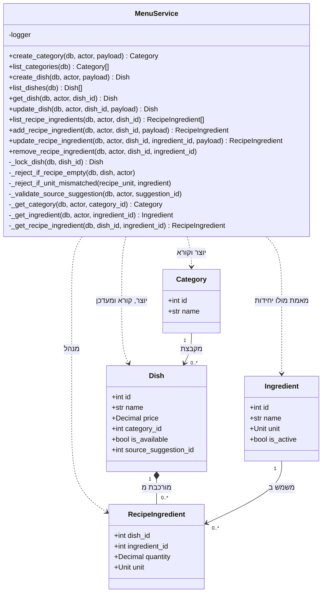

# דיאגרמת מחלקות: מודול התפריט

## הסבר המחלקות

1. **שלוש מהמתודות הפרטיות הן שומרות סף, ולא עזרי נוחות.** הן קיימות כדי שכלל עסקי ייכתב
   פעם אחת ויישמר משני כיוונים:

   - `_reject_if_recipe_empty` נקראת **גם** בעת סימון מנה כזמינה **וגם** בעת הסרת שורת
     מתכון. אלה שני כיוונים לאותו כלל: מנה זמינה חייבת מתכון. בלי המתודה המשותפת, אפשר
     היה לתקן כיוון אחד ולשכוח את השני.
   - `_reject_if_unit_mismatched` אוכפת שיחידת המידה בשורת המתכון זהה ליחידת המרכיב.
     המערכת אינה ממירה בין יחידות, ואי-התאמה הייתה מנכה כמות שגויה **בלי הודעת שגיאה**.
   - `_validate_source_suggestion` מוודאת שההצעה קיימת, לא נדחתה ולא אושרה כבר.

2. **`_lock_dish` נועלת את המנה בשני הכיוונים של הכלל.** סימון כזמינה והסרת השורה האחרונה
   הן פעולות שיכולות להתרחש במקביל, ובלי הנעילה שתיהן היו יכולות להצליח יחד ולהשאיר מנה
   זמינה בלי מתכון.

3. **יצירת מנה היא הנתיב היחיד שבו הצעת מתכון הופכת למנה.** אין מתודת "אשר הצעה" נפרדת:
   האישור הוא יצירת מנה שנושאת הפניה להצעה. **הבדיקה המקדימה יכולה להפסיד מרוץ לשתי
   יצירות מקבילות, ולכן האכיפה האמיתית היא אילוץ הייחודיות במבנה**, וההתנגשות שנוצרת ממנו
   מתורגמת לשגיאה מנומקת ולא לתקלת שרת.

4. **הקשר בין מנה לשורות המתכון הוא הרכבה** (מעוין מלא): שורת מתכון אינה קיימת בלי המנה
   שלה. לעומת זאת **הקשר מהמרכיב לשורת המתכון הוא שיוך רגיל**: המרכיב קיים בזכות עצמו
   ומשמש מנות רבות.

5. **קטגוריות ניתנות ליצירה ולקריאה בלבד** בגרסה זו. אין עריכה ואין מחיקה, בהתאם לכלל
   שאין מחיקה במערכת.
