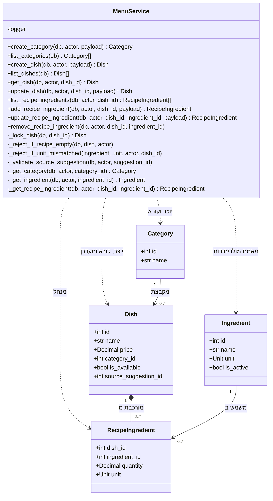

# דיאגרמת מחלקות: מודול התפריט

```mermaid
classDiagram
    direction TB

    class MenuService {
        -logger
        +create_category(db, actor, payload) Category
        +list_categories(db) Category[]
        +create_dish(db, actor, payload) Dish
        +list_dishes(db) Dish[]
        +get_dish(db, actor, dish_id) Dish
        +update_dish(db, actor, dish_id, payload) Dish
        +list_recipe_ingredients(db, actor, dish_id) RecipeIngredient[]
        +add_recipe_ingredient(db, actor, dish_id, payload) RecipeIngredient
        +update_recipe_ingredient(db, actor, dish_id, ingredient_id, payload) RecipeIngredient
        +remove_recipe_ingredient(db, actor, dish_id, ingredient_id)
        -_lock_dish(db, dish_id) Dish
        -_reject_if_recipe_empty(db, dish, actor)
        -_reject_if_unit_mismatched(ingredient, unit, actor, dish_id)
        -_validate_source_suggestion(db, actor, suggestion_id)
        -_get_category(db, actor, category_id) Category
        -_get_ingredient(db, actor, ingredient_id) Ingredient
        -_get_recipe_ingredient(db, actor, dish_id, ingredient_id) RecipeIngredient
    }

    class Category {
        +int id
        +str name
    }

    class Dish {
        +int id
        +str name
        +Decimal price
        +int category_id
        +bool is_available
        +int source_suggestion_id
    }

    class RecipeIngredient {
        +int dish_id
        +int ingredient_id
        +Decimal quantity
        +Unit unit
    }

    class Ingredient {
        +int id
        +str name
        +Unit unit
        +bool is_active
    }

    MenuService ..> Category : יוצר וקורא
    MenuService ..> Dish : יוצר, קורא ומעדכן
    MenuService ..> RecipeIngredient : מנהל
    MenuService ..> Ingredient : מאמת מולו יחידות
    Category "1" --> "0..*" Dish : מקבצת
    Dish "1" *-- "0..*" RecipeIngredient : מורכבת מ
    Ingredient "1" --> "0..*" RecipeIngredient : משמש ב
```

*מודול התפריט. `MenuService` מנהל קטגוריות, מנות ושורות מתכון, ואוכף באמצעות שומרי סף
פרטיים את הכלל שלפיו מנה זמינה חייבת מתכון.*
