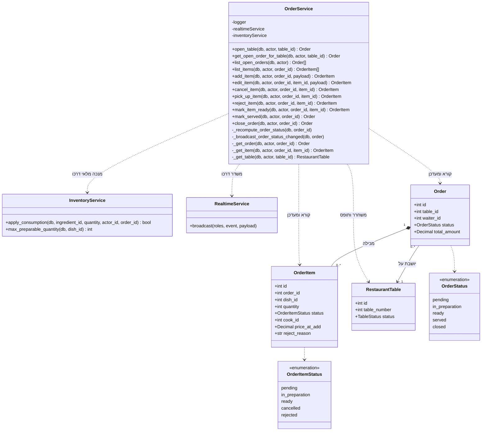

# דיאגרמת מחלקות: מודול ההזמנות

```mermaid
classDiagram
    direction TB

    class OrderService {
        -logger
        -realtimeService
        -inventoryService
        +open_table(db, actor, table_id) Order
        +get_open_order_for_table(db, actor, table_id) Order
        +list_open_orders(db, actor) Order[]
        +list_items(db, actor, order_id) OrderItem[]
        +add_item(db, actor, order_id, payload) OrderItem
        +edit_item(db, actor, order_id, item_id, payload) OrderItem
        +cancel_item(db, actor, order_id, item_id) OrderItem
        +pick_up_item(db, actor, order_id, item_id) OrderItem
        +reject_item(db, actor, order_id, item_id) OrderItem
        +mark_item_ready(db, actor, order_id, item_id) OrderItem
        +mark_served(db, actor, order_id) Order
        +close_order(db, actor, order_id) Order
        -_recompute_order_status(db, order_id)
        -_broadcast_order_status_changed(db, order)
        -_get_order(db, actor, order_id) Order
        -_get_item(db, actor, order_id, item_id) OrderItem
        -_get_table(db, actor, table_id) RestaurantTable
    }

    class InventoryService {
        +apply_consumption(db, ingredient_id, quantity, actor_id, order_id) bool
        +max_preparable_quantity(db, dish_id) int
    }

    class RealtimeService {
        +broadcast(roles, event, payload)
    }

    class Order {
        +int id
        +int table_id
        +int waiter_id
        +OrderStatus status
        +Decimal total_amount
    }

    class OrderItem {
        +int id
        +int order_id
        +int dish_id
        +int quantity
        +OrderItemStatus status
        +int cook_id
        +Decimal price_at_add
        +str reject_reason
    }

    class RestaurantTable {
        +int id
        +int table_number
        +TableStatus status
    }

    class OrderStatus {
        <<enumeration>>
        pending
        in_preparation
        ready
        served
        closed
    }

    class OrderItemStatus {
        <<enumeration>>
        pending
        in_preparation
        ready
        cancelled
        rejected
    }

    OrderService ..> InventoryService : מנכה מלאי דרכו
    OrderService ..> RealtimeService : משדר דרכו
    OrderService ..> Order : קורא ומעדכן
    OrderService ..> OrderItem : קורא ומעדכן
    OrderService ..> RestaurantTable : משחרר ותופס
    Order "1" *-- "0..*" OrderItem : מכילה
    Order "0..*" --> "1" RestaurantTable : יושבת על
    Order ..> OrderStatus
    OrderItem ..> OrderItemStatus
```

*מודול ההזמנות. `OrderService` מרכז את כל שלבי חייה של ההזמנה, ומקבל בהזרקה את שירות
המלאי ואת שירות העדכונים החיים במקום לממש את יכולותיהם בעצמו.*
