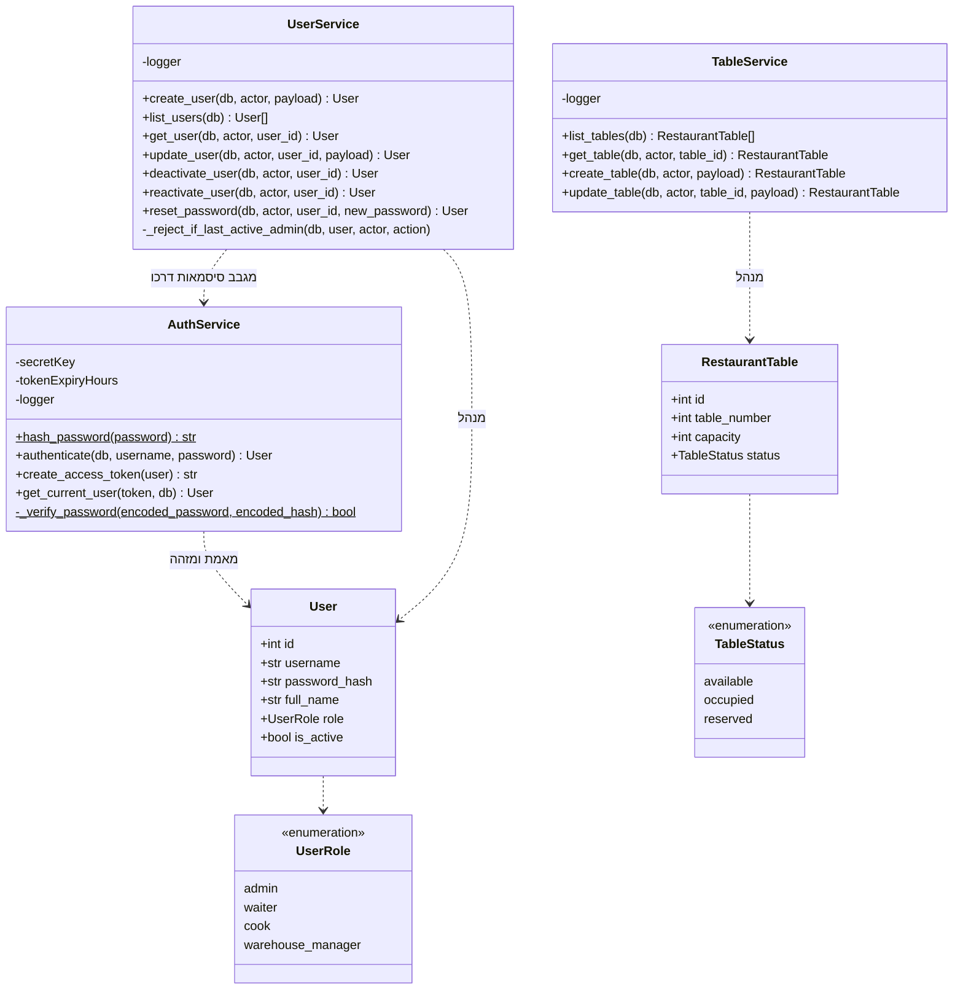

# דיאגרמת מחלקות: מודול המשתמשים וההרשאות

```mermaid
classDiagram
    direction TB

    class AuthService {
        -secretKey
        -tokenExpiryHours
        -logger
        +hash_password(password)$ str
        +authenticate(db, username, password) User
        +create_access_token(user) str
        +get_current_user(token, db) User
        -_verify_password(encoded_password, encoded_hash)$ bool
    }

    class UserService {
        -logger
        +create_user(db, actor, payload) User
        +list_users(db) User[]
        +get_user(db, actor, user_id) User
        +update_user(db, actor, user_id, payload) User
        +deactivate_user(db, actor, user_id) User
        +reactivate_user(db, actor, user_id) User
        +reset_password(db, actor, user_id, new_password) User
        -_reject_if_last_active_admin(db, user, actor, action)
    }

    class TableService {
        -logger
        +list_tables(db) RestaurantTable[]
        +get_table(db, actor, table_id) RestaurantTable
        +create_table(db, actor, payload) RestaurantTable
        +update_table(db, actor, table_id, payload) RestaurantTable
    }

    class User {
        +int id
        +str username
        +str password_hash
        +str full_name
        +UserRole role
        +bool is_active
    }

    class RestaurantTable {
        +int id
        +int table_number
        +int capacity
        +TableStatus status
    }

    class UserRole {
        <<enumeration>>
        admin
        waiter
        cook
        warehouse_manager
    }

    class TableStatus {
        <<enumeration>>
        available
        occupied
        reserved
    }

    AuthService ..> User : מאמת ומזהה
    UserService ..> User : מנהל
    UserService ..> AuthService : מגבב סיסמאות דרכו
    TableService ..> RestaurantTable : מנהל
    User ..> UserRole
    RestaurantTable ..> TableStatus
```

*מודול המשתמשים וההרשאות. `AuthService` עונה על שאלת הזהות, `UserService` מנהל את
החשבונות, ו-`TableService` מנהל את השולחנות כהגדרה של המסעדה.*
