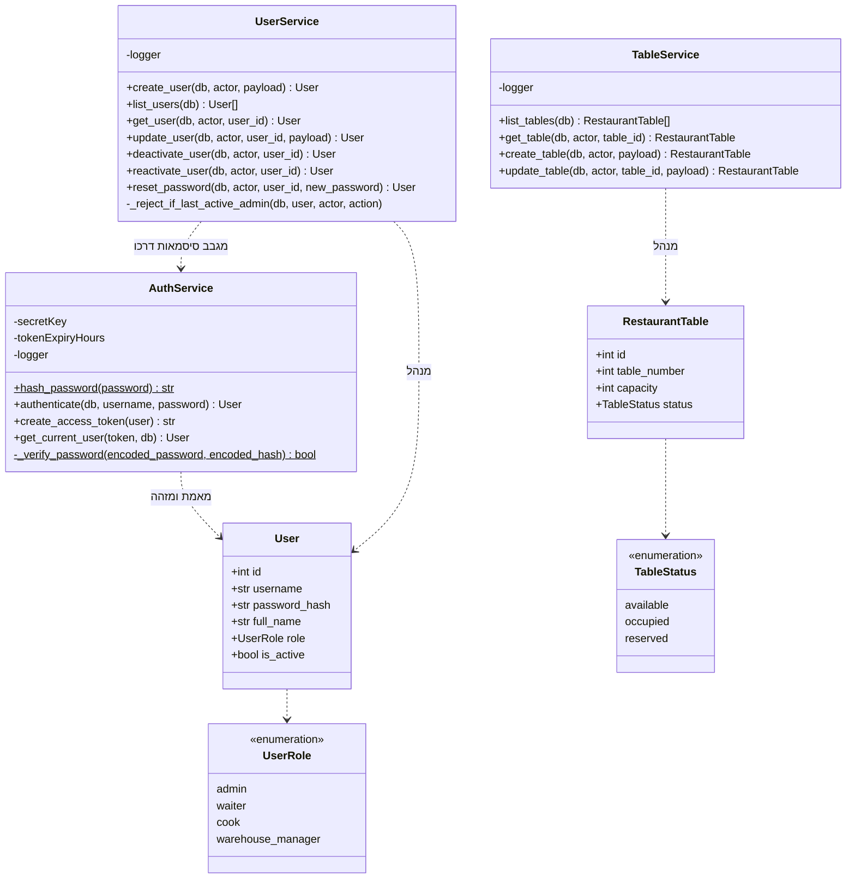

# דיאגרמת מחלקות: מודול המשתמשים וההרשאות

## הסבר המחלקות

1. **`AuthService` ו-`UserService` מופרדים בכוונה**, למרות ששניהם עוסקים במשתמש. הראשון
   עונה על "מי אתה", השני על "מי קיים ומה מותר לו". להפרדה יש תוצאה מעשית: כל נתיב במערכת
   עובר דרך `AuthService`, ואילו `UserService` נדרש רק במסכי הניהול.

2. **`hash_password` היא מתודה סטטית**, ולכן `UserService` יכול לגבב סיסמה בעת יצירת
   משתמש בלי להחזיק מופע של `AuthService`. הגיבוב קיים במקום אחד בלבד, ולכן אי אפשר שנתיב
   אחד יגבב אחרת מנתיב אחר.

3. **`_reject_if_last_active_admin` היא ההגנה מפני נעילה מחוץ למערכת.** היא נקראת מכל
   פעולה שיכולה לצמצם את מספר המנהלים הפעילים: שינוי תפקיד והשבתה. בלעדיה אפשר היה להשאיר
   מערכת בלי אף מנהל, ואז אין דרך ליצור מנהל חדש והמערכת ננעלת לצמיתות.

4. **הרשאה אינה מחלקה אלא בונה של תלות.** במקום מחלקת הרשאה, קיימת פונקציה שמקבלת רשימת
   תפקידים ומחזירה בודק מותאם. כל נתיב מצהיר על הבודק שלו. **הבודק בנוי מעל בדיקת הזהות
   ואינו חוזר עליה**, ולכן נתיב מוגן הוא תמיד גם מאומת.

   פרק 7 מפרט מדוע זהו שילוב של דפוס Factory עם Strategy.

5. **`TableService` נמצא כאן ולא במודול ההזמנות** מפני שהשולחן הוא **הגדרה של המסעדה**,
   כמו משתמש, ולא חלק ממחזור החיים של הזמנה. פתיחת שולחן להזמנה שייכת ל-`OrderService`.

6. **`password_hash` מופיע בישות אך לעולם לא במבנה תשובה.** אין נתיב במערכת שמחזיר אותו,
   גם לא למנהל.
