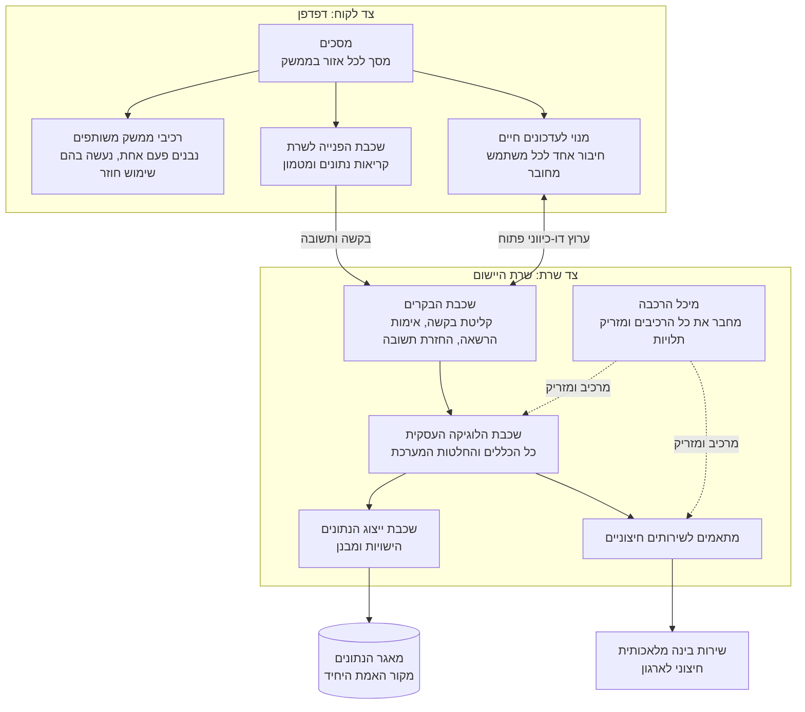

# דיאגרמת רכיבים: מבנה המערכת

## הסבר הרכיבים

### צד לקוח

1. **מסכים** - מסך אחד לכל אזור בממשק, מוגבל לתפקיד שמורשה לראותו. המסך אחראי על מה
   שמוצג ועל סדר הפעולות, ואינו מכיל כללים עסקיים משלו.
2. **רכיבי ממשק משותפים** - רכיבים שנבנים פעם אחת ומשמשים מסכים רבים, למשל סימון מצב של
   פריט הזמנה. כך אותו מידע נראה זהה בכל מקום שבו הוא מופיע.
3. **שכבת הפנייה לשרת** - הנקודה **היחידה** בצד הלקוח שמדברת עם השרת. היא גם מחזיקה מטמון
   של הנתונים שנקראו, כדי שמעבר בין מסכים לא ייצור פנייה חוזרת מיותרת.
4. **מנוי לעדכונים חיים** - חיבור אחד ופתוח לכל משתמש מחובר, שדרכו השרת דוחף הודעות על
   שינויים. המסכים נרשמים אליו ומרעננים את הנתונים שהשתנו.

### צד שרת

5. **שכבת הבקרים** - קולטת את הבקשה, מוודאת שהמשתמש מחובר ושתפקידו מורשה לפעולה, ומעבירה
   הלאה. **אין בה כללים עסקיים ואין בה גישה ישירה לנתונים.**
6. **שכבת הלוגיקה העסקית** - כאן נמצאים כל הכללים: מתי מותר לקחת פריט להכנה, כמה לנכות
   מהמלאי, מתי מופקת התרעה, מי רשאי לאשר הצעה. **זו השכבה היחידה שמחליטה משהו.**
7. **שכבת ייצוג הנתונים** - מגדירה את הישויות ואת המבנה שלהן, ומתרגמת בינן לבין מאגר
   הנתונים. אין בה כללים עסקיים.
8. **מתאמים לשירותים חיצוניים** - כל פנייה אל מחוץ למערכת עוברת דרכם. הלוגיקה העסקית
   מכירה מתאם, לא ספק מסוים.
9. **מיכל ההרכבה** - מרכיב את כל הרכיבים בהפעלת המערכת ומזריק לכל אחד את מה שהוא צריך.
   **אף רכיב אינו יוצר בעצמו את התלויות שלו.**

### רכיבים חיצוניים

10. **מאגר הנתונים** - מקור האמת היחיד. אין מצב שנשמר במקום אחר וסותר אותו.
11. **שירות הבינה המלאכותית** - שירות חיצוני לארגון, שהמערכת אינה שולטת בזמינותו. לכן
    הגישה אליו מבודדת מאחורי מתאם, ותקלה בו אינה מפילה שום מודול אחר.

## שני מסלולי תקשורת, ולא אחד

בין הלקוח לשרת עוברים **שני** ערוצים נפרדים, וההפרדה ביניהם מכוונת:

- **ערוץ הבקשה והתשובה** משמש לכל פעולה שהמשתמש יוזם. הוא מתחיל אצל הלקוח ומסתיים בתשובה.
- **הערוץ הדו-כיווני** נשאר פתוח, ודרכו **השרת** יוזם ומודיע ללקוח שמשהו השתנה. בלעדיו
  מלצר לא היה יודע שהמטבח סיים מנה בלי ללחוץ רענון.

ההודעה שנדחפת בערוץ החי היא **סימן לרענן ולא העברת נתונים**: הלקוח מקבל הודעה שמשהו
בתחום מסוים השתנה, ומושך את הנתונים המעודכנים בערוץ הרגיל. כך אין שתי דרכים שונות שבהן
נתון מגיע ללקוח, ואין סכנה ששתיהן יציגו דברים שונים.
