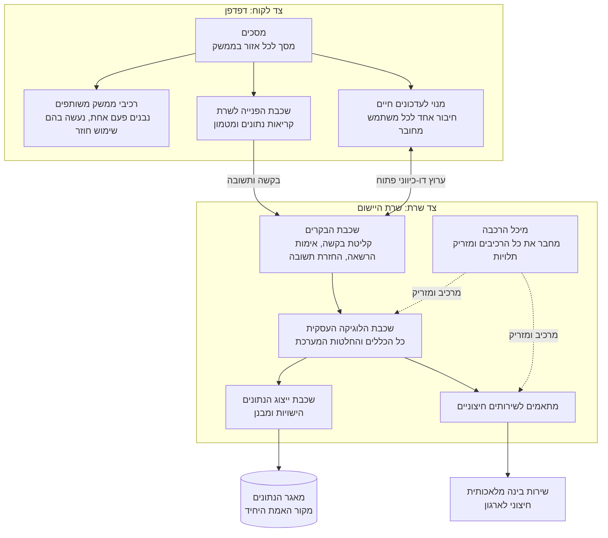

# דיאגרמת רכיבים: מבנה המערכת

```mermaid
flowchart TB
    subgraph CLIENT["צד לקוח: דפדפן"]
        direction TB
        pages["מסכים<br/>מסך לכל אזור בממשק"]
        comps["רכיבי ממשק משותפים<br/>נבנים פעם אחת, נעשה בהם שימוש חוזר"]
        api_client["שכבת הפנייה לשרת<br/>קריאות נתונים ומטמון"]
        live["מנוי לעדכונים חיים<br/>חיבור אחד לכל משתמש מחובר"]
    end

    subgraph SERVER["צד שרת: שרת היישום"]
        direction TB
        controllers["שכבת הבקרים<br/>קליטת בקשה, אימות הרשאה, החזרת תשובה"]
        logic["שכבת הלוגיקה העסקית<br/>כל הכללים והחלטות המערכת"]
        entities["שכבת ייצוג הנתונים<br/>הישויות ומבנן"]
        adapters["מתאמים לשירותים חיצוניים"]
        wiring["מיכל הרכבה<br/>מחבר את כל הרכיבים ומזריק תלויות"]
    end

    db[("מאגר הנתונים<br/>מקור האמת היחיד")]
    ai["שירות בינה מלאכותית<br/>חיצוני לארגון"]

    pages --> comps
    pages --> api_client
    pages --> live
    api_client -- "בקשה ותשובה" --> controllers
    live <-- "ערוץ דו-כיווני פתוח" --> controllers
    controllers --> logic
    logic --> entities
    logic --> adapters
    entities --> db
    adapters --> ai
    wiring -. "מרכיב ומזריק" .-> logic
    wiring -. "מרכיב ומזריק" .-> adapters
```

*מבנה המערכת: צד לקוח, צד שרת ומאגר הנתונים, יחד עם שירות הבינה המלאכותית
החיצוני. החצים הרציפים מסמנים בקשה ותשובה, והחץ הדו-כיווני מסמן את ערוץ העדכונים החיים.*
