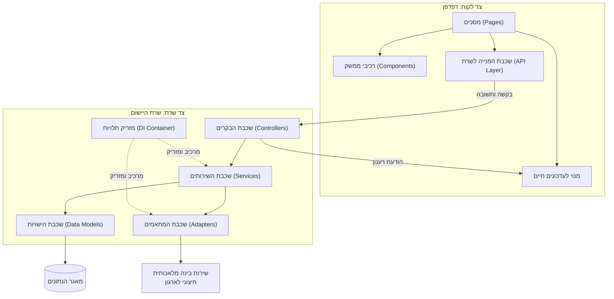

# דיאגרמת רכיבים: מבנה המערכת

*מבנה המערכת: צד לקוח, צד שרת ומאגר הנתונים, יחד עם שירות הבינה המלאכותית החיצוני.
החצים הרציפים מסמנים בקשה ותשובה, החץ מן הבקרים אל מנוי העדכונים מסמן את הודעות הרענון
הנדחפות בערוץ החי, והחצים המקווקווים מסמנים בנייה והזרקה של תלויות על ידי מזריק התלויות.*
