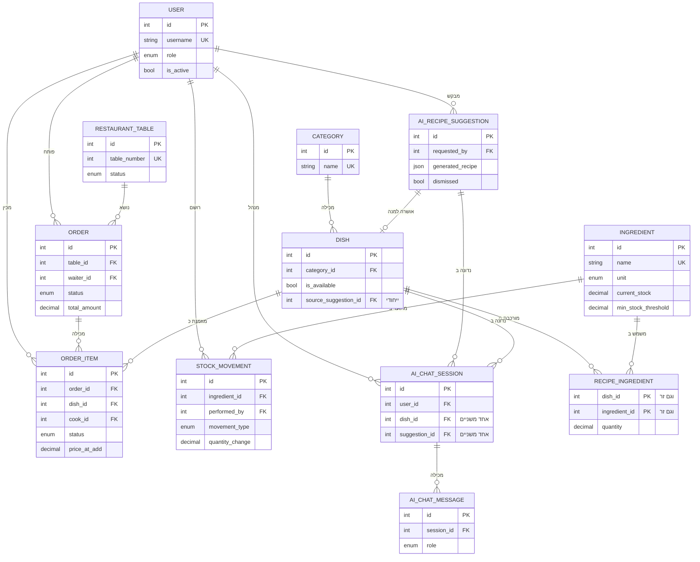

# דיאגרמת ER: הישויות והקשרים ביניהן

*הישויות והקשרים ביניהן. הדיאגרמה מציגה את המפתחות ואת השדות הנושאים משמעות לקשרים
בלבד, כדי שתישאר קריאה בגודל עמוד. הפירוט המלא של כל שדה נמצא בטבלאות שבסעיף 4.2.*
