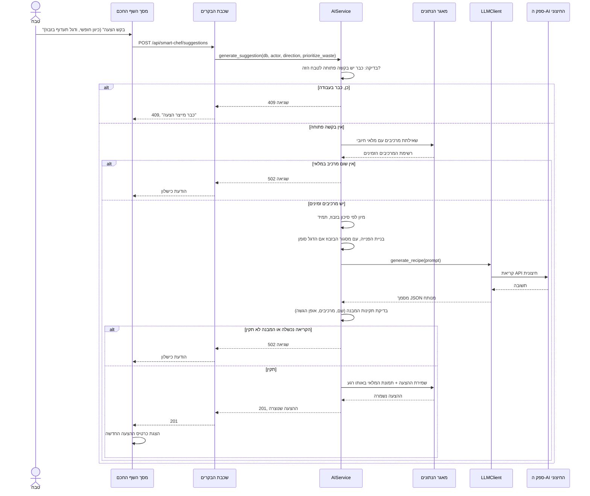

# דיאגרמת רצף: הצעת מתכון מהשף החכם

```mermaid
sequenceDiagram
    actor Cook as טבח
    participant UI as מסך השף החכם
    participant API as שכבת הבקרים
    participant AIS as AIService
    participant DB as מאגר הנתונים
    participant LLM as LLMClient
    participant EXT as ספק ה-AI החיצוני

    Cook->>UI: "בקש הצעה" (כיוון חופשי, ודגל תעדוף בזבוז)
    UI->>API: POST /api/smart-chef/suggestions
    API->>AIS: generate_suggestion(db, actor, direction, prioritize_waste)

    AIS->>AIS: בדיקה: כבר יש בקשה פתוחה לטבח הזה?
    alt כן, כבר בעבודה
        AIS-->>API: שגיאה 409
        API-->>UI: 409, "כבר מייצר הצעה"
    else אין בקשה פתוחה
        AIS->>DB: שאילתת מרכיבים עם מלאי חיובי
        DB-->>AIS: רשימת המרכיבים הזמינים

        alt אין שום מרכיב במלאי
            AIS-->>API: שגיאה 502
            API-->>UI: הודעת כישלון
        else יש מרכיבים זמינים
            AIS->>AIS: מיון לפי סיכון בזבוז, תמיד
            AIS->>AIS: בניית הפנייה, עם מסגור הבזבוז אם הדגל סומן
            AIS->>LLM: generate_recipe(prompt)
            LLM->>EXT: קריאת API חיצונית
            EXT-->>LLM: תשובה
            LLM-->>AIS: מסמך JSON מנותח

            AIS->>AIS: בדיקת תקינות המבנה (שם, מרכיבים, אופן הגשה)
            alt הקריאה נכשלה או המבנה לא תקין
                AIS-->>API: שגיאה 502
                API-->>UI: הודעת כישלון
            else תקין
                AIS->>DB: שמירת ההצעה + תמונת המלאי באותו רגע
                DB-->>AIS: ההצעה נשמרה
                AIS-->>API: 201, ההצעה שנוצרה
                API-->>UI: 201
                UI->>UI: הצגת כרטיס ההצעה החדשה
            end
        end
    end
```

*הפקת הצעת מתכון. שלוש בדיקות עוצרות את התהליך לפני כל כתיבה למאגר, וההצעה נשמרת יחד
עם צילום המלאי שממנו נוצרה.*
