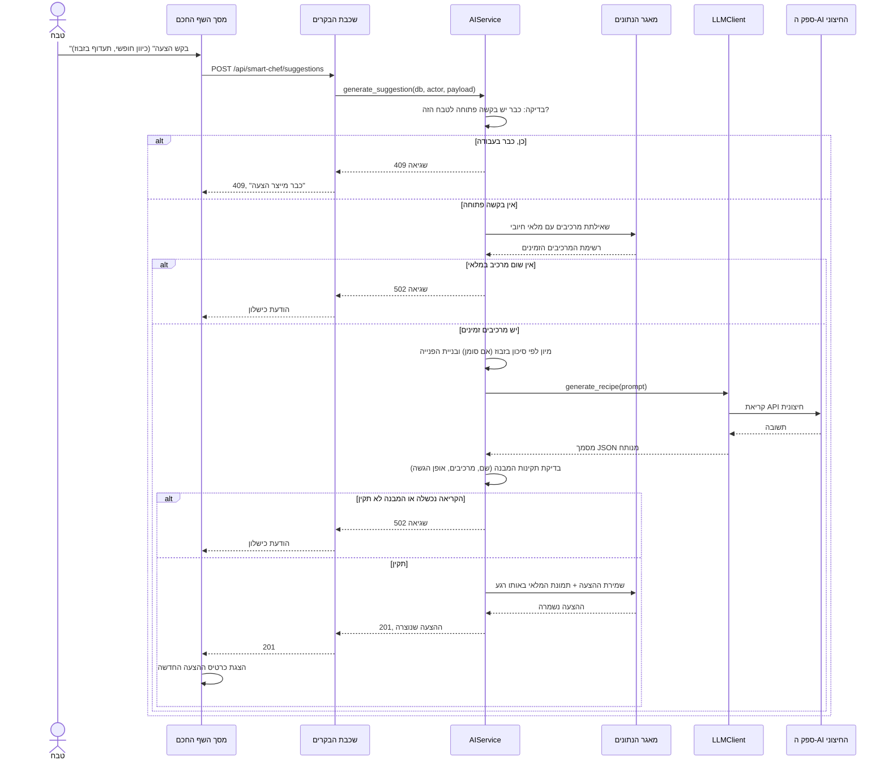

# דיאגרמת רצף: הצעת מתכון מהשף החכם

## הסבר הפעולות

הדיאגרמה הזו ממחישה שני עקרונות מפרק 7 יחד, על אותו תהליך אחד:

**Adapter (7.4).** `AIService` אינו יודע איזה ספק AI עומד מאחורי `LLMClient` ואינו מייבא
את ספריית הספק בעצמו - הוא מכיר מתודה אחת, `generate_recipe`, שמחזירה מסמך במבנה קבוע.
לו היה צריך להחליף ספק, השינוי מוגבל **לקובץ אחד**.

**עצירה לפני שנוצר נזק, לא אחריו.** שלוש בדיקות בדיאגרמה קיימות בדיוק כדי שאף שורה
לא תיכתב למאגר על סמך מידע בעייתי: בקשה כפולה נחסמת **לפני** כל קריאה למאגר או לספק
(כך שאין שתי הצעות שנוצרות בו-זמנית מאותו טבח), אין מרכיבים נבדק **לפני** שמנוסחת פנייה
ריקה לספק, והמבנה של התשובה נבדק **לפני** שהיא נשמרת - תשובה שנחזרת כ-JSON תקין אך
חסרה שדה נדרש (לדוגמה "אופן הגשה") לא הופכת ל"הצעה מוצלחת" רק כי היא JSON תקין.

**שימו לב שאין כאן שום ניכוי מלאי.** ההצעה רק *מציעה* להשתמש במרכיבים - היא תמונת מצב
(snapshot) של המלאי ברגע היצירה, לא הזמנה על המלאי. הניכוי בפועל קורה רק מאוחר יותר,
ורק אם מנהל יאשר את ההצעה כמנה בתפריט וטבח יכין אותה (ראו `sequence-pickup`) - בדיוק
העיקרון שמתואר בהנחה ה-17 בפרק ההנחות: תוצר של המערכת אינו מגיע ללקוח בלי אישור אנושי.
