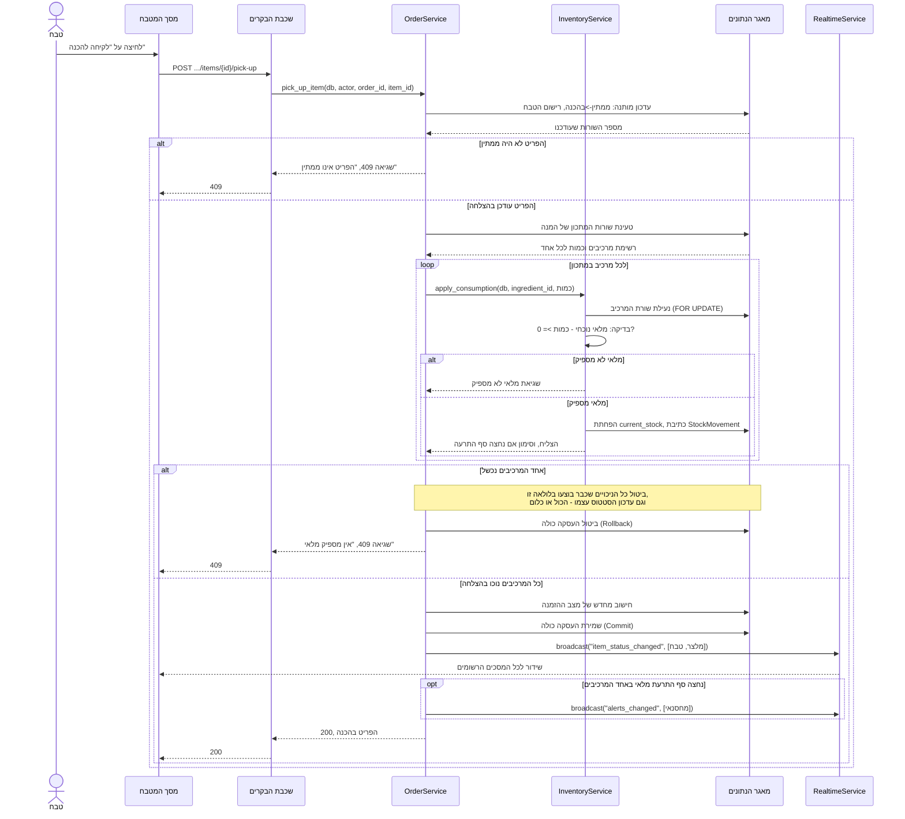

# דיאגרמת רצף: לקיחת פריט להכנה עם ניכוי מלאי אטומי

## הסבר הפעולות

הדיאגרמה הזו ממחישה את **הכול-או-כלום** שמאחורי לקיחת פריט להכנה (עקרון 5.4 בפרק
הארכיטקטורה, ודפוס הזרקת התלויות בפרק 7.1 - `OrderService` מקבל את `InventoryService`
מוזרק ואינו יוצר אותו בעצמו).

**נקודת ההכרעה האמיתית היא הכתיבה למאגר, לא בדיקה מוקדמת.** העדכון על הפריט עצמו הוא
עדכון מותנה (`WHERE status = 'ממתין'`), לא קריאה ואז כתיבה - זה מה שמכריע מרוץ בין שני
טבחים שלוחצים על אותו פריט באותו רגע (ראו 7.6, State כמכונת מצבים נאכפת). אותו עיקרון
חוזר בתוך `apply_consumption`: שורת המרכיב ננעלת (`FOR UPDATE`) לפני שנבדק אם המלאי
מספיק, כדי ששתי בקשות מקבילות על אותו מרכיב לא יראו שתיהן "יש מספיק" ויפילו את המלאי
מתחת לאפס.

**הביטול חוצה שירותים.** אם המרכיב השלישי מתוך חמישה נכשל, שני הניכויים הראשונים כבר
הצליחו - אבל הם רשומים על אותה עסקת מאגר (Unit of Work) שהעדכון על הפריט עצמו רשום
עליה, ולכן ביטול אחד מבטל את כולם יחד. זו הסיבה שאין במערכת שכבת Repository נפרדת לכל
ישות (7.8): שני שירותים צריכים להשתתף בעסקה אחת בלתי ניתנת לפיצול.

**השידור מגיע רק אחרי ה-Commit**, לעולם לא לפניו (עיקרון מפורש בדפוס Observer, 7.5) -
אחרת מסך הטבח האחר היה מתעדכן על שינוי שעוד עלול להתבטל.
