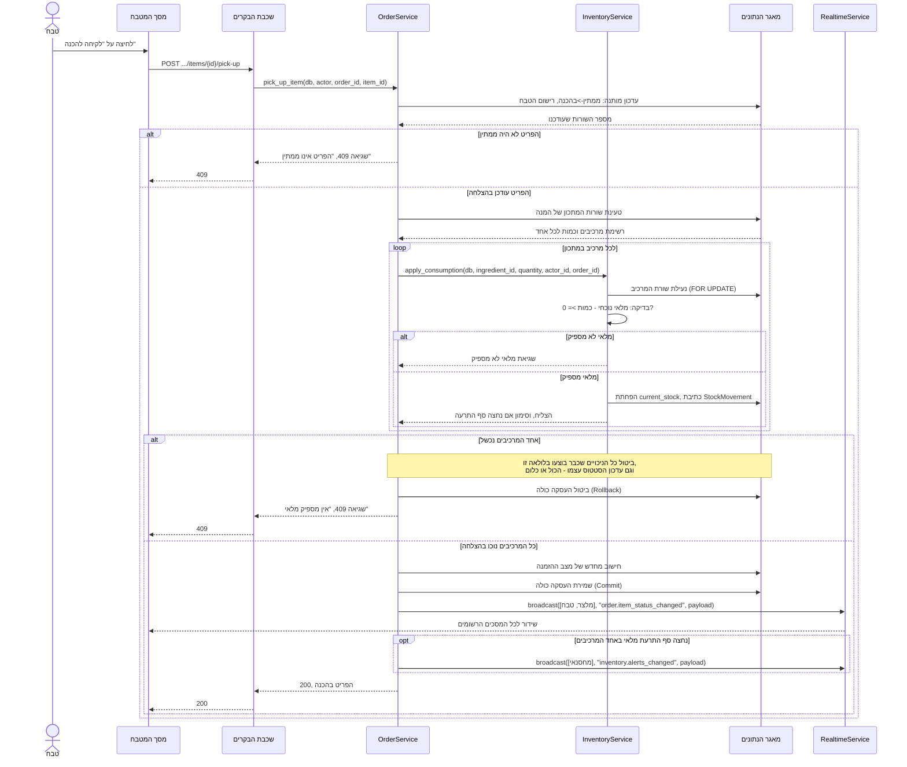

# דיאגרמת רצף: לקיחת פריט להכנה עם הפחתת מלאי אטומית

```mermaid
sequenceDiagram
    actor Cook as טבח
    participant UI as מסך המטבח
    participant API as שכבת הבקרים
    participant OS as OrderService
    participant IS as InventoryService
    participant DB as מאגר הנתונים
    participant RT as RealtimeService

    Cook->>UI: לחיצה על "לקיחה להכנה"
    UI->>API: POST .../items/{id}/pick-up
    API->>OS: pick_up_item(db, actor, order_id, item_id)
    OS->>DB: עדכון מותנה: ממתין->בהכנה, רישום הטבח
    DB-->>OS: מספר השורות שעודכנו

    alt הפריט לא היה ממתין
        OS-->>API: שגיאה 409, "הפריט אינו ממתין"
        API-->>UI: 409
    else הפריט עודכן בהצלחה
        OS->>DB: טעינת שורות המתכון של המנה
        DB-->>OS: רשימת מרכיבים וכמות לכל אחד

        loop לכל מרכיב במתכון
            OS->>IS: apply_consumption(db, ingredient_id, quantity, actor_id, order_id)
            IS->>DB: נעילת שורת המרכיב (FOR UPDATE)
            IS->>IS: בדיקה: מלאי נוכחי - כמות >= 0?
            alt מלאי לא מספיק
                IS-->>OS: שגיאת מלאי לא מספיק
            else מלאי מספיק
                IS->>DB: הפחתת current_stock, כתיבת StockMovement
                IS-->>OS: הצליח, וסימון אם נחצה סף התרעה
            end
        end

        alt אחד המרכיבים נכשל
            Note over OS,DB: ביטול כל הניכויים שכבר בוצעו בלולאה זו,<br/>וגם עדכון הסטטוס עצמו - הכול או כלום
            OS->>DB: ביטול העסקה כולה (Rollback)
            OS-->>API: שגיאה 409, "אין מספיק מלאי"
            API-->>UI: 409
        else כל המרכיבים נוכו בהצלחה
            OS->>DB: חישוב מחדש של מצב ההזמנה
            OS->>DB: שמירת העסקה כולה (Commit)
            OS->>RT: broadcast([מלצר, טבח], "order.item_status_changed", payload)
            RT-->>UI: שידור לכל המסכים הרשומים
            opt נחצה סף התרעת מלאי באחד המרכיבים
                OS->>RT: broadcast([מחסנאי], "inventory.alerts_changed", payload)
            end
            OS-->>API: 200, הפריט בהכנה
            API-->>UI: 200
        end
    end
```

*לקיחת פריט להכנה. עדכון מותנה על מצב הפריט, ניכוי נעול לכל מרכיב במתכון, שמירה אחת
משותפת לכולם, ושידור המתרחש רק לאחריה.*
