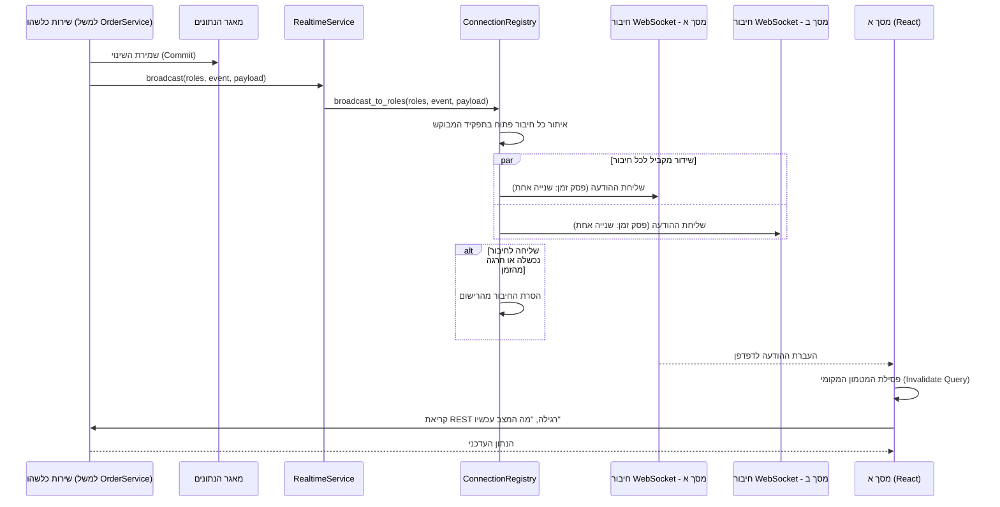

# דיאגרמת רצף: שידור עדכון בזמן אמת (Observer / Pub-Sub)

```mermaid
sequenceDiagram
    participant SVC as שירות כלשהו (למשל OrderService)
    participant DB as מאגר הנתונים
    participant RT as RealtimeService
    participant CR as ConnectionRegistry
    participant WS1 as חיבור WebSocket - מסך א
    participant WS2 as חיבור WebSocket - מסך ב
    participant UI1 as מסך א (React)

    SVC->>DB: שמירת השינוי (Commit)
    SVC->>RT: broadcast(roles, event, payload)
    RT->>CR: broadcast_to_roles(roles, event, payload)
    CR->>CR: איתור כל חיבור פתוח בתפקיד המבוקש

    par שידור מקביל לכל חיבור
        CR->>WS1: שליחת ההודעה (פסק זמן: שנייה אחת)
        and
        CR->>WS2: שליחת ההודעה (פסק זמן: שנייה אחת)
    end

    alt שליחה לחיבור נכשלה או חרגה מהזמן
        CR->>CR: הסרת החיבור מהרישום
    end

    WS1-->>UI1: העברת ההודעה לדפדפן
    UI1->>UI1: פסילת המטמון המקומי (Invalidate Query)
    UI1->>SVC: קריאת REST רגילה, "מה המצב עכשיו"
    SVC-->>UI1: הנתון העדכני
```

*מנגנון השידור החי, המשותף לכל עדכון במערכת. השידור יוצא רק לאחר השמירה, וההודעה
הנשלחת היא סימן לרענון ולא הנתון עצמו.*
