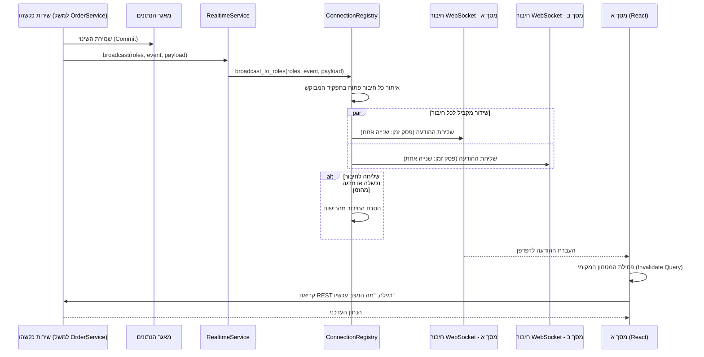

# דיאגרמת רצף: שידור עדכון בזמן אמת (Observer / Pub-Sub)

## הסבר הפעולות

זו הדיאגרמה הכללית שמאחורי **כל** עדכון חי במערכת - לקיחת פריט, דחייתו, הוספת פריט
חדש, שינוי מצב הזמנה, והתרעת מלאי. אין דיאגרמה נפרדת לכל אחד מהם כי המנגנון זהה; מה
שמשתנה בין מקרה למקרה הוא רק שם האירוע, תוכן המטען, ורשימת התפקידים שמקבלים אותו.

**שתי נקודות שהדיאגרמה הזו קיימת כדי להבהיר, בהמשך ישיר לפרק 7.5:**

1. **השידור קורה רק אחרי ה-Commit, לא לפניו.** אם שירות היה משדר לפני השמירה, מסך אחר
   היה מקבל התראה על שינוי שעוד יכול להתבטל (למשל אם שורה בהמשך אותה עסקה נכשלת).
2. **המטען הוא סימן לרענן, לא הנתון עצמו.** מסך שמקבל את האירוע לא קורא נתונים מתוכו
   ומציג אותם ישירות - הוא רק פוסל את מה שיש לו במטמון וקורא שוב בערוץ הרגיל (REST).
   כך יש **דרך אחת בלבד** שבה נתון סופי מגיע למסך, ואי אפשר ששני מסלולים (השידור וה-REST)
   יציגו בטעות ערכים סותרים.

**ההפרדה בין `RealtimeService` ל-`ConnectionRegistry`** היא דוגמה נוספת לדפוס Adapter
(7.4): `RealtimeService` הוא מה ששירותי העסקים מכירים ("שדר לתפקידים האלה"), ו-
`ConnectionRegistry` הוא מה שבאמת מחזיק את החיבורים הגולמיים ויודע להתמודד עם חיבור
שנפל. שירות עסקי אף פעם אינו נוגע בחיבור עצמו.
