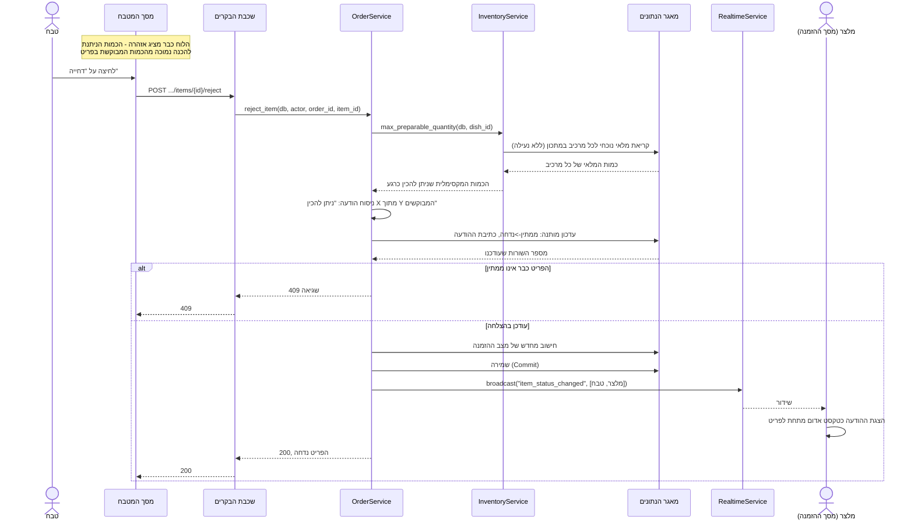

# דיאגרמת רצף: דחיית פריט מחוסר מלאי

```mermaid
sequenceDiagram
    actor Cook as טבח
    participant UI as מסך המטבח
    participant API as שכבת הבקרים
    participant OS as OrderService
    participant IS as InventoryService
    participant DB as מאגר הנתונים
    participant RT as RealtimeService
    actor Waiter as מלצר (מסך ההזמנה)

    Note over UI: הלוח כבר מציג אזהרה - הכמות הניתנת<br/>להכנה נמוכה מהכמות המבוקשת בפריט

    Cook->>UI: לחיצה על "דחייה"
    UI->>API: POST .../items/{id}/reject
    API->>OS: reject_item(db, actor, order_id, item_id)

    OS->>IS: max_preparable_quantity(db, dish_id)
    IS->>DB: קריאת מלאי נוכחי לכל מרכיב במתכון (ללא נעילה)
    DB-->>IS: כמות המלאי של כל מרכיב
    IS-->>OS: הכמות המקסימלית שניתן להכין כרגע

    OS->>OS: ניסוח הודעה: "ניתן להכין X מתוך Y המבוקשים"
    OS->>DB: עדכון מותנה: ממתין->נדחה, כתיבת ההודעה
    DB-->>OS: מספר השורות שעודכנו

    alt הפריט כבר אינו ממתין
        OS-->>API: שגיאה 409
        API-->>UI: 409
    else עודכן בהצלחה
        OS->>DB: חישוב מחדש של מצב ההזמנה
        OS->>DB: שמירה (Commit)
        OS->>RT: broadcast("item_status_changed", [מלצר, טבח])
        RT-->>Waiter: שידור
        Waiter->>Waiter: הצגת ההודעה כטקסט אדום מתחת לפריט
        OS-->>API: 200, הפריט נדחה
        API-->>UI: 200
    end
```

*דחיית פריט מחוסר מלאי. חישוב הכמות הניתנת להכנה הוא קריאה בלבד ואינו נועל דבר, ומה
שנאכף אטומית הוא המעבר עצמו ולא הסיבה שמאחוריו.*
