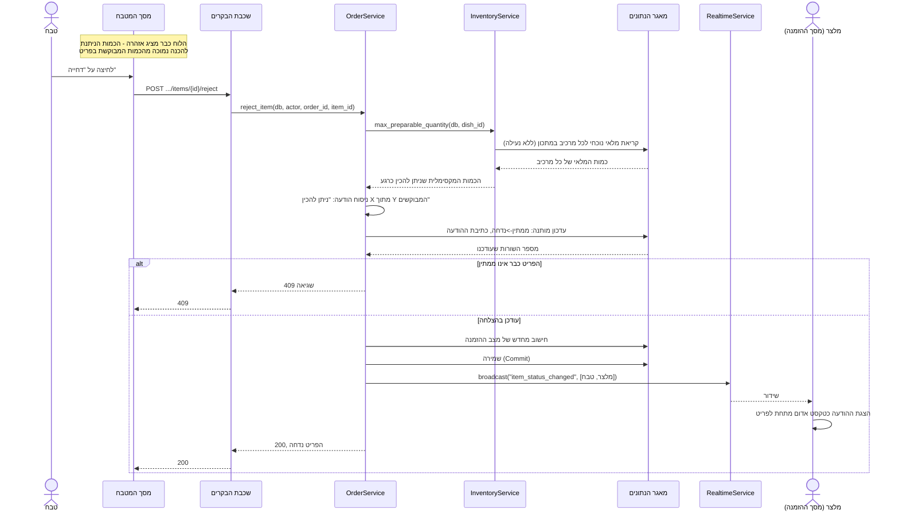

# דיאגרמת רצף: דחיית פריט מחוסר מלאי

## הסבר הפעולות

הדיאגרמה הזו ממחישה נקודה שקל לפספס: **הדחייה עצמה לעולם אינה נועלת ואינה נוגעת במלאי.**
`max_preparable_quantity` היא קריאה בלבד, בלי `FOR UPDATE`, בניגוד גמור לניכוי בפועל
בדיאגרמת האיסוף (`sequence-pickup`). זו החלטת עיצוב מכוונת: הדחייה היא ייעוץ למי שמחליט,
לא פעולה שמשנה משאב משותף, ולכן אין שום סיבה להתחרות איתה על נעילה.

**החישוב יכול להיות לא-עדכני ברגע הכתיבה, וזה מקובל.** בין הרגע שבו הלוח הציג את האזהרה
לרגע שבו הטבח לוחץ "דחייה" יכול לחלוף זמן שבו מלאי אחר השתנה. הדיאגרמה לא מציגה בדיקה
חוזרת שחוסמת את הדחייה אם המלאי כבר הספיק - הטבח החליט לדחות, וההודעה רק מנמקת בכמות
הטובה ביותר שידועה כרגע. זהו יישום ישיר של העיקרון בפרק 7.6: **המעבר עצמו הוא מה שנאכף
אטומית (`WHERE status = 'ממתין'`), לא הסיבה שמאחוריו.**

**אין כאן ביטול מלאי, כי לא היה ניכוי מלכתחילה.** זה ההבדל המהותי מול ביטול פריט
שכבר בהכנה (4.4 בפרק האפיון): שם המלאי כבר נוכה ונשאר מנוכה, כאן הוא כלל לא נוגע.
