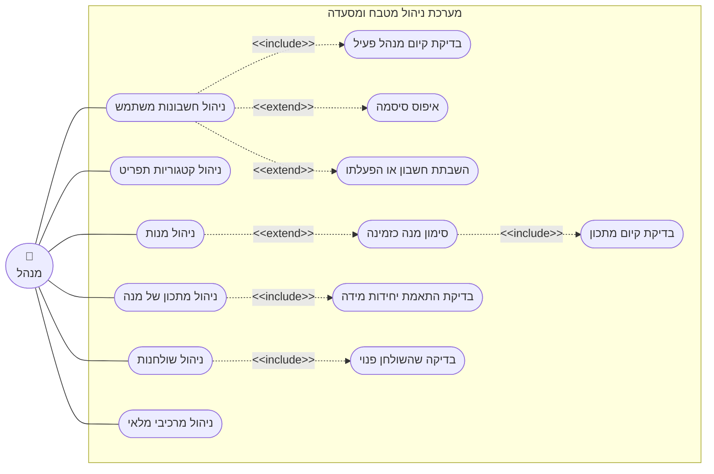

# דיאגרמת Use-Case: מנהל - ניהול תפריט, שולחנות ומשתמשים

## הסבר הפעולות

1. **ניהול חשבונות משתמש** - יצירת חשבון, צפייה ברשימת העובדים, שינוי שם מלא או תפקיד.
2. **ניהול קטגוריות תפריט** - יצירת קטגוריות שאליהן משויכות המנות.
3. **ניהול מנות** - יצירת מנה ועריכתה: שם, תיאור, מחיר, קטגוריה וזמן הכנה משוער.
4. **ניהול מתכון של מנה** - הוספה, עריכה והסרה של שורות מרכיב במתכון.
5. **ניהול שולחנות** - הוספת שולחן ועריכת מספרו או קיבולתו. שולחן אינו נמחק לעולם.
6. **ניהול מרכיבי מלאי** - למנהל אותה גישה למלאי שיש למחסנאי, לצורך פיקוח והתערבות.
7. **בדיקת קיום מנהל פעיל** *(include)* - כל שינוי בחשבון משתמש נבדק מראש, ופעולה שתשאיר
   את המערכת בלי אף מנהל פעיל נחסמת.
8. **איפוס סיסמה** *(extend)* - המנהל קובע סיסמה חדשה לעובד ששכח את שלו. סיסמה קיימת אינה
   ניתנת להצגה, רק להחלפה.
9. **השבתת חשבון או הפעלתו** *(extend)* - עובד מושבת אינו יכול להיכנס, אך ההיסטוריה שלו
   נשמרת והמנות שהכין נשארות רשומות על שמו.
10. **סימון מנה כזמינה** *(extend)* - הפיכת מנה למנה שניתן להזמין. מנה חדשה תמיד נוצרת
    כלא-זמינה.
11. **בדיקת קיום מתכון** *(include)* - מנה אינה יכולה להפוך לזמינה כל עוד אין לה מתכון,
    ואי אפשר להסיר את המרכיב האחרון ממתכון של מנה זמינה.
12. **בדיקת התאמת יחידות מידה** *(include)* - יחידת המידה בשורת מתכון חייבת להיות זהה
    לזו של המרכיב, מפני שהמערכת אינה ממירה בין יחידות.
13. **בדיקה שהשולחן פנוי** *(include)* - עריכת שולחן מותרת רק כשאין עליו הזמנה פתוחה.

> פעולות המנהל מול השף החכם - אישור ודחייה של הצעות מתכון - מרוכזות בדיאגרמה נפרדת:
> `usecase-smart-chef.md`.
