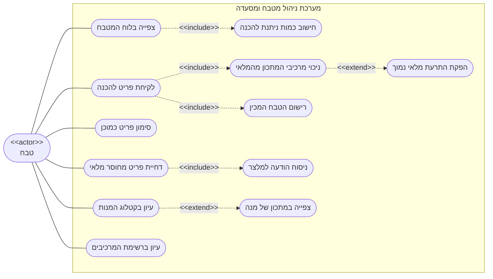

# דיאגרמת Use-Case: טבח - לוח המטבח

## הסבר הפעולות

1. **צפייה בלוח המטבח** - הטבח רואה את כל פריטי ההזמנה הפעילים בכל המסעדה, מקובצים לפי
   שולחן, והלוח מתעדכן מאליו כשמלצר מוסיף פריט חדש.
2. **לקיחת פריט להכנה** - הטבח מתחיל להכין מנה. זו הפעולה היחידה במערכת שמנכה מלאי.
3. **סימון פריט כמוכן** - סיום ההכנה. מכאן האחריות עוברת למלצר. כל טבח פעיל יכול לסמן
   כמוכן פריט שטבח אחר לקח.
4. **דחיית פריט מחוסר מלאי** - הטבח דוחה פריט ממתין שאין עבורו מספיק מרכיבים.
5. **ביטול פריט הזמנה** - הסרת פריט, למשל בעקבות בקשת הסועד שהמלצר העביר בעל-פה.
6. **עיון בקטלוג המנות** - קריאה בלבד של התפריט, לצורך היכרות עם המנות.
7. **עיון ברשימת המרכיבים** - קריאה בלבד של המלאי הקיים.
8. **חישוב כמות ניתנת להכנה** *(include)* - בכל טעינה של הלוח המערכת מחשבת לכל פריט
   ממתין כמה מנות ניתן להכין ממנו כרגע, ומתריעה כשהכמות המבוקשת גדולה מהאפשרי.
9. **ניכוי מרכיבי המתכון מהמלאי** *(include)* - כל לקיחה להכנה מנכה את המרכיבים כפול
   כמות הפריט. אם המלאי אינו מספיק, הפעולה כולה נדחית ושום דבר אינו משתנה.
10. **רישום הטבח המכין** *(include)* - הפריט נרשם על שם מי שלקח אותו, לצורך תיעוד בלבד.
11. **הפקת התרעת מלאי נמוך** *(extend)* - כאשר הניכוי מוריד מרכיב מתחת לרף שהוגדר לו,
    נוצרת התרעה למחסנאי. הרחבה זו מתרחשת רק כשהרף נחצה בפועל.
12. **ניסוח הודעה למלצר** *(include)* - כל דחייה מייצרת הודעה המציינת כמה מנות אפשר היה
    להכין, וההודעה מוצגת למלצר במסך ההזמנה.
13. **צפייה במתכון של מנה** *(extend)* - מתוך קטלוג המנות הטבח יכול לפתוח את המתכון של
    מנה מסוימת.
