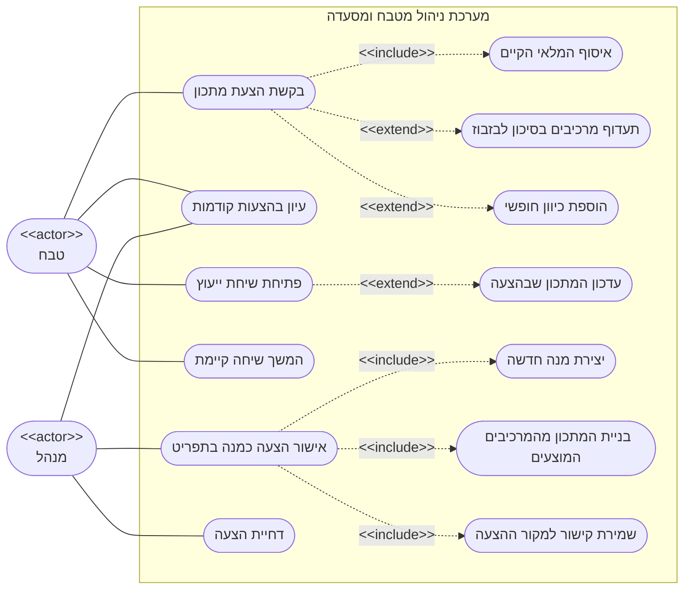

# דיאגרמת Use-Case: שף חכם - הצעת מתכון, אישור לתפריט ושיחת ייעוץ

## הסבר הפעולות

1. **בקשת הצעת מתכון** *(טבח)* - הטבח מבקש מהשף החכם רעיון למנה חדשה, המבוסס על מה שקיים
   במלאי באותו רגע. בקשה שנייה של אותו טבח בזמן שהראשונה עדיין מתבצעת נדחית ואינה נכנסת
   לתור.
2. **עיון בהצעות קודמות** *(טבח ומנהל)* - היסטוריית ההצעות, החדשות ראשונות. ההצעות של
   המשתמש הנוכחי מוצגות בראש הרשימה, אך הוא רואה גם את ההצעות של האחרים.
3. **פתיחת שיחת ייעוץ** *(טבח)* - דיאלוג חופשי עם השף החכם סביב הצעת מתכון או סביב מנה
   קיימת בתפריט. שתי הודעות במקביל באותה שיחה נדחות.
4. **המשך שיחה קיימת** *(טבח)* - חזרה לשיחה קודמת והמשכה מהמקום שבו הופסקה.
5. **אישור הצעה כמנה בתפריט** *(מנהל)* - המנהל משלים קטגוריה, מחיר וזמן הכנה, ומאשר את
   שורות המתכון. אותה הצעה אינה ניתנת לאישור פעמיים.
6. **דחיית הצעה** *(מנהל)* - הסרת ההצעה מרשימת ההצעות הממתינות.
7. **איסוף המלאי הקיים** *(include)* - כל בקשה מבוססת על צילום מצב של המרכיבים שיש מהם
   מלאי בפועל.
8. **תעדוף מרכיבים בסיכון לבזבוז** *(extend)* - הטבח יכול לבקש שההצעה תעדיף מרכיבים
   שכמותם גבוהה ביחס לרף שנקבע להם.
9. **הוספת כיוון חופשי** *(extend)* - הטבח יכול לצרף הנחיה בלשון חופשית, שאינה גוברת על
   מגבלת המלאי.
10. **עדכון המתכון שבהצעה** *(extend)* - שיחה סביב **הצעה** יכולה לשנות את המתכון שבה.
    שיחה סביב **מנה קיימת בתפריט** היא לייעוץ בלבד ואינה משנה את המנה.
11. **יצירת מנה חדשה** *(include)* - האישור הוא הנתיב היחיד שבו הצעה הופכת למנה שניתן
    להזמין. ההצעה עצמה לעולם אינה כותבת לתפריט.
12. **בניית המתכון מהמרכיבים המוצעים** *(include)* - המערכת מתאימה את המרכיבים שההצעה
    מנתה למרכיבים הקיימים במלאי, וכל שורה ניתנת לעריכה על ידי המנהל לפני האישור.
13. **שמירת קישור למקור ההצעה** *(include)* - המנה החדשה זוכרת מאיזו הצעה נוצרה, כך שניתן
    לדעת בדיעבד אילו מנות בתפריט התחילו כהצעה של השף החכם.
