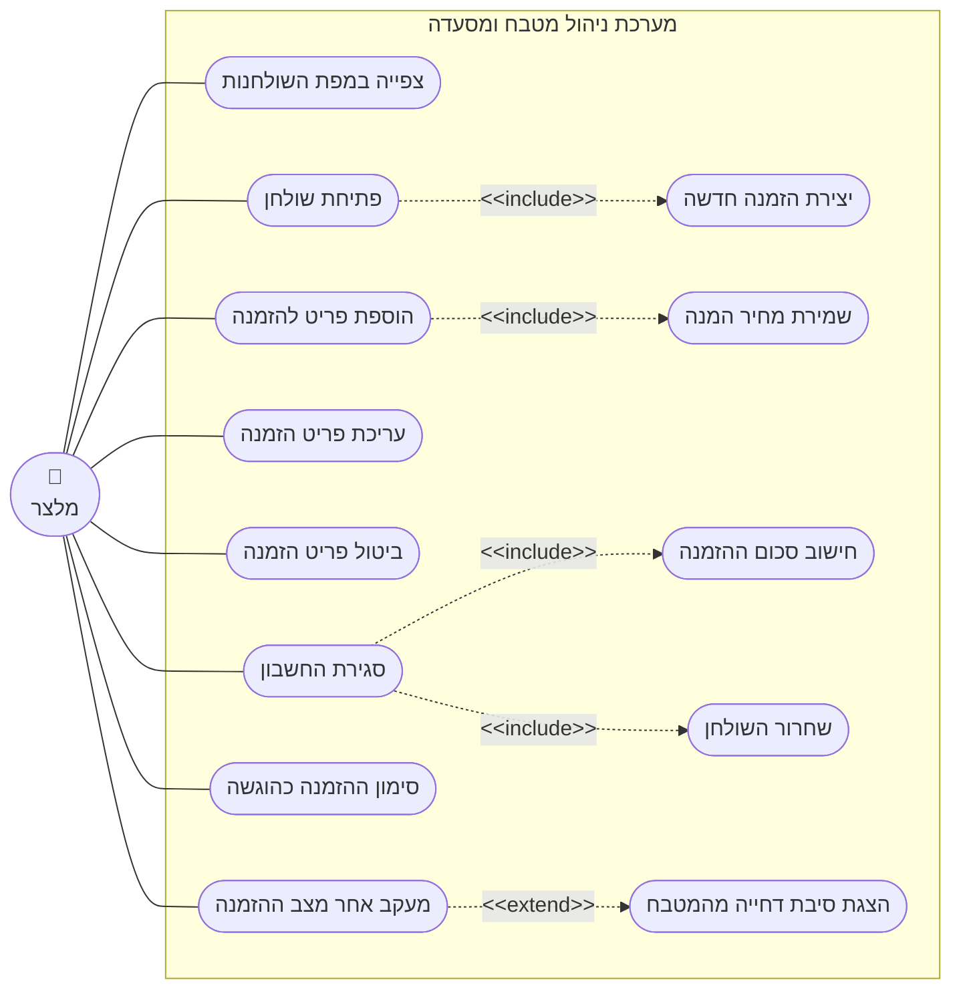

# דיאגרמת Use-Case: מלצר - ניהול שולחנות והזמנות

## הסבר הפעולות

1. **צפייה במפת השולחנות** - המלצר רואה את כל שולחנות המסעדה ואת מצב כל אחד: פנוי, תפוס
   או שמור, ואילו מהם דורשים את תשומת ליבו.
2. **פתיחת שולחן** - המלצר בוחר שולחן פנוי ומסמן שסועדים התיישבו בו.
3. **הוספת פריט להזמנה** - המלצר בוחר מנה מהתפריט, קובע כמות ומוסיף הערה חופשית.
4. **עריכת פריט הזמנה** - שינוי כמות או הערה של פריט שעדיין ממתין ולא נלקח להכנה.
5. **ביטול פריט הזמנה** - הסרת פריט מההזמנה, גם אם כבר נמצא בהכנה.
6. **מעקב אחר מצב ההזמנה** - צפייה במצב העדכני של כל פריט, המתעדכן מאליו כשהמטבח מתקדם.
7. **סימון ההזמנה כהוגשה** - המלצר מאשר שכל המנות הונחו על השולחן.
8. **סגירת החשבון** - סיום הארוחה וקבלת הסכום לתשלום.
9. **יצירת הזמנה חדשה** *(include)* - כל פתיחת שולחן יוצרת עבורו הזמנה ריקה.
10. **שמירת מחיר המנה** *(include)* - כל הוספת פריט מקבעת את מחיר המנה באותו רגע.
11. **חישוב סכום ההזמנה** *(include)* - כל סגירת חשבון מסכמת את מחירי הפריטים הפעילים.
12. **שחרור השולחן** *(include)* - כל סגירת חשבון מחזירה את השולחן למצב פנוי.
13. **הצגת סיבת דחייה מהמטבח** *(extend)* - כאשר המטבח דחה פריט, המלצר רואה גם את הסבר
    הדחייה. הרחבה זו מתרחשת רק בתרחיש הדחייה, ולא בכל מעקב.
