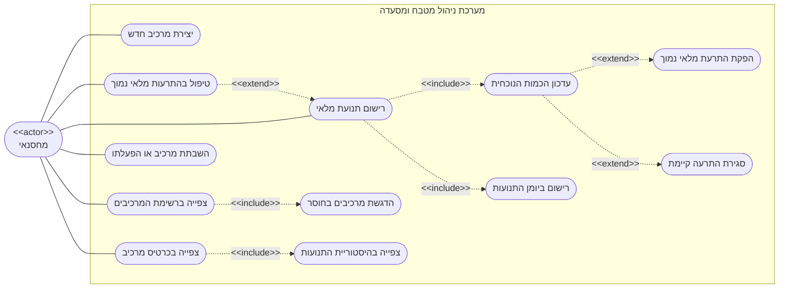

# דיאגרמת Use-Case: מחסנאי - ניהול מלאי והתרעות

## הסבר הפעולות

1. **יצירת מרכיב חדש** - המחסנאי מגדיר מרכיב: שם, יחידת מידה, כמות התחלתית ורף מלאי
   מינימלי שמתחתיו תופק התרעה.
2. **צפייה ברשימת המרכיבים** - כל המרכיבים והכמות הנוכחית של כל אחד, עם אפשרות מיון לפי
   כל עמודה.
3. **צפייה בכרטיס מרכיב** - הכמות הנוכחית, רף המינימום והיסטוריית התנועות של מרכיב בודד.
4. **רישום תנועת מלאי** - קנייה, פחת או התאמת ספירה, עם הערה חופשית. תנועת צריכה אינה
   ניתנת לרישום ידני: היא נוצרת רק על ידי המטבח.
5. **השבתת מרכיב או הפעלתו** - מרכיב שיצא משימוש מושבת ואינו יכול לקבל תנועות או להיכנס
   למתכון חדש, אך היסטוריית התנועות שלו נשמרת.
6. **טיפול בהתרעות מלאי נמוך** - צפייה ברשימת ההתרעות הפעילות, ומעבר ממנה ישירות לכרטיס
   המרכיב.
7. **הדגשת מרכיבים בחוסר** *(include)* - הרשימה תמיד מציגה מרכיבים בחוסר מודגשים ובראש.
8. **צפייה בהיסטוריית התנועות** *(include)* - כל כרטיס מרכיב מציג את כל התנועות שלו,
   כולל תנועות הצריכה שנוצרו אוטומטית על ידי המטבח.
9. **עדכון הכמות הנוכחית** *(include)* - כל תנועה משנה את הכמות. תנועה שתוריד את הכמות
   מתחת לאפס נדחית.
10. **רישום ביומן התנועות** *(include)* - אין שינוי בכמות ללא רישום מתאים ביומן, והיומן
    אינו ניתן לעריכה בדיעבד.
11. **הפקת התרעת מלאי נמוך** *(extend)* - כשהכמות יורדת מתחת לרף, נוצרת התרעה.
12. **סגירת התרעה קיימת** *(extend)* - כשהכמות שוחזרה מעל הרף, ההתרעה נעלמת מאליה. אין
    פעולת "סימון כטופל".
